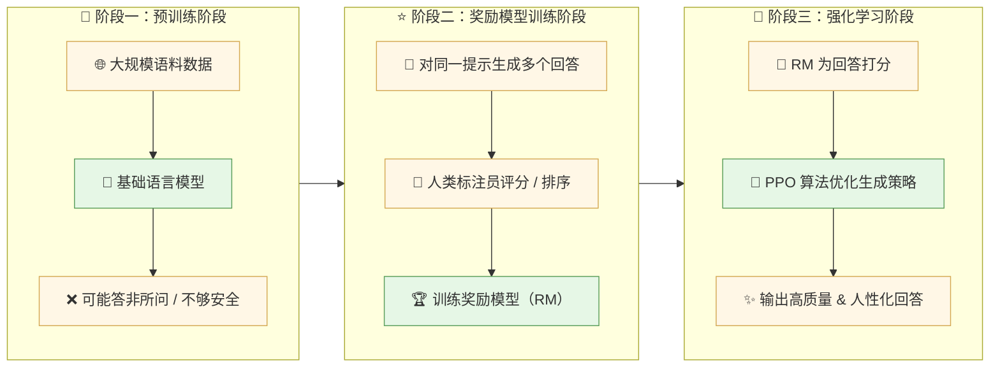
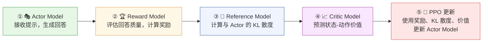
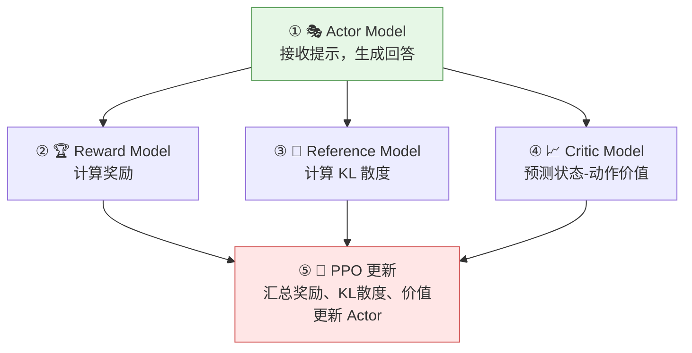

## RLHF 背景和意义

没有 RLHF 就没有今天的 ChatGPT。 

RLHF 是 ChatGPT 背后最关键的技术之一，它使得模型更好地理解和满足用户需求，提升用户体验。这对 OpenAI 的成功至关重要，从技术和商业两个方面来看，RLHF 带来的价值极其巨大。

2022年底 ChatGPT 的发布是 RLHF 爆红的标志事件：

**ChatGPT 一炮而红**：
- 发布后 **5天内用户突破 100 万**，是历史上增长最快的互联网产品之一。
- 仅用 **两个月** 达到 1 亿月活用户，这种增长速度比抖音、Instagram 等顶级应用快的多。对于一家技术型公司而非娱乐公司，这一现象打破里所有历史的巅峰。<color=red>这背后的关键技术之一正是 RLHF。

**RLHF 的收益评估**：
- **直接营收估算**：
    - 据报道，截至2024年ChatGPT每月用户量接近1.8亿，其中订阅用户数占比可观。即使只有5%的用户订阅Plus，每月也有 **$1.8亿（1.8 亿用户 × 5% × $20）** 的订阅收入。RLHF可以说贡献了其中大部分收入。  
- **估值增长**：
    - OpenAI 的估值从几年前的数十亿美元攀升至如今的 **900 亿美元以上**，RLHF 的独特性是其估值增长的重要因素之一。

**资本和企业竞相追逐**：
- 全球涌现了大量创业公司，专注于将 RLHF 应用于特定场景（如个性化助手、医疗、教育等）。
- 投资界对大模型相关项目的关注空前，RLHF 的热度直接推动了数百亿美金的融资。

**RLHF 就像“风口上的猪”，凡是搭上这股技术浪潮的公司，估值都在暴涨，创业者和资本都争先恐后地涌入。**

**RLHF之于OpenAI，犹如iPhone之于Apple**：
- iPhone 不是 Apple 的第一款产品，但它彻底改变了 Apple 的命运，让它成为消费电子领域的领导者。同样，RLHF让OpenAI从一家以研究为主的实验室，转变为一家具有巨大战略价值和商业影响力的公司。 
- iPhone 重新定义了手机，RLHF 重新定义了 AI 的人机交互体验。 

**RLHF 就像科技圈的 “世界杯”，每次新研究或新模型发布，都能掀起行业内外的热烈讨论。**

### 什么是 RLHF

RLHF（Reinforcement Learning with Human Feedback，<hl=red>基于人类反馈的强化学习</hl>）是一种结合**强化学习**和**人类反馈**的方法，用来训练人工智能模型，使其行为更符合人类的需求和偏好。
- 它的核心目标是解决模型输出不够贴近人类需求的问题，让 AI 不仅能“回答问题”，还能“回答得好、回答得安全”。

简单讲：RLHF 就是通过人类告诉 AI 什么是“好答案”，然后让 AI 学会用强化学习的方法优化自己，生成更符合人类期望的内容。

### 一定需要 RLHF 么 ？

需要 RLHF 的主要原因是：为了让人工智能模型的输出更符合人类的需求和偏好，解决传统机器学习方法中的一些核心问题。

1. 解决预定义奖励函数的局限性：
    - 奖励函数难以设计：很多现实任务（如对话、内容生成）中，无法用简单的公式或规则量化“好”或“坏”。例如：什么样的文章是“好“的？什么样的回答是”贴心“的？这些都很主观。
    - 奖励信号不明确：在一些复杂场景中（如聊天机器人），模型很难通过环境的直接反馈（如用户点击）学习出明确的优化方向。

2. 优化模型的“人性化”表现
    - 缺乏语境理解：无法准确理解用户的意图。
    - 表现不自然：回答生硬、不礼貌，缺乏“人情味”。
    - 过于自信或偏离主题：模型可能对错误答案表现得非常自信，一本正经的胡说八道

3. 提高内容安全性
    - 有害内容：例如歧视性语言、不当言论。 
    - 危险建议：如非法操作、医学错误。  
    - 偏见问题：受训练数据的限制，可能输出带有偏见的答案。  

4. 个人化与定制化需求
    - 专业用户：希望回答技术型强且准确。
    - 普通用户：希望回答通俗易懂、易于接受。
    - 特定领域：如法律、医学等领域的用户，需要模型能针对性地生成内容。

通过人类的多维度反馈，模型能够逐步学习如何在多个目标之间找到最佳平衡点，实现综合性能的提升。

>   假设你是一位老师，正在教一个学生（AI 模型）写作文：   
1. 预训练模型就像这个学生从图书馆借来了一大堆书，自己学习写作技巧。虽然他掌握了基本技能，但写出来的作文可能不合人意（太死板、太离题或缺乏深度）。   
2. RLHF就像老师给学生的作文打分、提供反馈：“这一段太啰嗦了”，“这个观点很好”，逐渐让学生明白什么样的作文更受欢迎。   
最终，这个学生不仅掌握了技术，还学会了如何更好地打动“老师”（用户），写出既合格又有感染力的文章。  
{: .prompt-tip }

总结：用户需求高度主观或多样化的任务、安全性和可靠性要求高的任务、任务目标复杂且难以明确量化、需要动态优化的场景都**需要RLHF**

**如果你的任务**：
1. **有明确目标和奖励函数的任务**：对于可以清晰定义目标和奖励的任务，传统的强化学习或其他机器学习方法可能就足够了
    - 机器人路径规划（目标是最短路径）
    - 游戏 AI（如通过最高分数优化）

2. **不需要高度人性化表现的任务**：任务只要求模型执行具体计算或数据分析，而不涉及与用户交互或主观偏好。
    - 图像分类任务（如猫狗识别）
    - 语音识别任务（将语音转化为文字）

3. **应用场景对用户偏好不敏感**：在某些领域，用户对 AI 的行为没有特别高的主观要求，模型只需按照明确的规则完成任务即可
    - 数据清洗任务
    - 财务报表的自动生成

4. **资源和成本受限的场景**： RLHF 的训练需要大量人类反馈，涉及高成本和复杂性。如果任务需求对人类反馈依赖不高，可以选择更简单的优化方法，如中小企业预算有限，想开发一款标准化 AI 聊天机器人。

RLHF 是否必要取决于任务的特点和目标：
- 如果任务目标模糊、需要个性化、安全性高且对人类偏好领域，则 RLHF 是非常需要的。
- 如果任务明确、不需要人性化表现，且已经有成熟规则或奖励函数，则 RLHF 不不是必须的。

## RLHF 流程分解

### RLHF 核心流程

RLHF 的过程可以分为三个主要阶段，如下图所示：

1. **预训练阶段**。使用大规模数据训练一个语言模型，让它学会语言的基本语法、语义和知识。这时候的模型虽然很强大，但回答可能会<color=yellow>答非所问、不够自然或礼貌、输出危险或不适当的内容。</color>

2. **奖励模型训练阶段（RMT, Reward Model Training）**。 此时引入来人类的反馈，比如：模型生成来一些回答（多个版本），人类对这些回答进行评分或排序（比如哪个更好、哪个更差），根据这些书记，训练一个<hl=red>奖励模型（Reward Model, RM），用来预测哪些回答更符合人类偏好</hl>。

3. **强化学习阶段（RL，Reinforcement Learning ）**。 利用 <hl=red>强化学习，如 PPO 算法，优化模型的生成策略：</hl> <mark>奖励模型提供评分，模型调整自己的输出行为，生成更高的回答，接着通过不断的试错和优化，模型最终能够生成更加优质和人性化的回答。</mark>

论文展示：[https://arxiv.org/pdf/2203.02155](https://arxiv.org/pdf/2203.02155)

官网展示：[https://openai.com/index/instruction-following/](https://openai.com/index/instruction-following/)

_RHLF_Reinforcement Learning from Human Feedback_基于人类反馈强化学习示意图_

_RHLF_Reinforcement Learning from Human Feedback_基于人类反馈强化学习示意图_

**第一步：训练监督策略模型：**
- 从提示词数据集中取样一个提示词：首先，从包含各种提示词的数据集中随机选取一个提示词作为输入
- 数据标记工程师给出期望的输出行为：然后，由人工标注员为这个提示词提供一个期望的故事内容或结构，这将作为模型的目标输出
- 通过监督学习，接下来，使用监督学习的方法对模型进行微词，使其能够基于提供的提示词生成接近于预期结果的故事

**第二步：训练奖励模型：**
- 取样一个提示词和模型多个输出：在这个阶段，再次从数据集抽取一个提示词，并让模型产生多个不同的故事版本。
- 数据标记工程师给出优劣排序：人工标注员会对这些不同版本的故事进行评估并按质量高低进行排序。
- 训练奖励模型：最后，用这些带有评分的故事样本去训练一个奖励模型，该模型学会预测哪些故事更符合人类的标准。

**第三步：采用近端策略优化进行强化学习：**
- 从提示词数据集取样一个新的提示词：继续从数据集中获取新的提示词作为下一个迭代的基础。
- PPO模型由模型初始化：使用之前训练好的模型开始生成故事。
- 模型生成一个输出：模型尝试根据新提示词生成一个完整的故事。
- 奖励模型计算输出奖励值：接着，奖励模型会评价这个新生成的故事，并给出相应的分数。
- 利用PPO算法结合奖励更新策略：最后，通过PPO算法，结合奖励模型的反馈来调整模型的行为，使得它在未来能够生成更加高质量的故事。

应用到 ChatGPT 的例子：

1. **基础模型阶段（预训练）**：ChatGPT 学会生成语法正确的文本，但回答不一定符合你的期望。比如你问：“今天北京的天气怎么样？”，**初期模型回答：** 可能会输出一堆天气概念或者乱答一通。

2. **人类反馈训练（奖励模型训练）：**：
    - 人类对模型的回答打分，“回答清楚天气状况”得高分；“答非所问”得低分。
    - 奖励模型学会预测用户更喜欢哪种回答。

3. **强化学习优化：**：ChatGPT 开始通过试错生成回答，并根据奖励模型的评分不断优化。  你再问：“今天北京的天气怎么样？”   **优化后回答**：“今天北京的天气晴朗，气温在10-15℃之间，非常适合外出活动。”  

>   这就好比一个是一个大学生刚毕业，然后进入到一家企业开始实习，学习了基础专业知识后。开始使用各种方式来测试自己学到的技能，来方便更好的让自己进步，尽快达到能够独立成为王者的阶段。 
{: .prompt-tip }

前边几节课已经通过使用lora的方式让模型如何学习某一个领域的知识。接下来就需要让模型反复训练自己能够在多种场景进行更好的回答(现在大模型强化学习阶段出现的算法组合方案层出不穷本次只简单列举三种)：
- 方案一：使用`PPO + reward(奖励模型)`组合成 `RLHF` 模式：就好比你这在学打篮球，不断练习投篮和过人技巧，并反复观看自己的练习视频每次进步一点点，并找教练指导、裁判来评分，边学边练。
- 方案二：使用`DPO + reward(奖励模型)`在网上下载一堆视频，不断学习别人好的技巧与坏的技巧，然后进行评判后学习。
- 方案三：仅仅使用`DPO`在网上下载一堆视频，不断学习别人好的技巧与坏的技巧，自我进行练习评判。

### 数据收集

RLHF 应用到 GPT 过程大致包括以下步骤：

1. 收集人类反馈数据。让人类标注者根据模型生成的内容进行排序或评分，提供偏好信号。数据形式通常是成对比较，例如：回答A比回答B更有用、更准确或更安全。

    

    

2. 训练奖励模型（Reward Modl, RM）：使用人类反馈数据训练一个奖励模型，预测生产内容的质量评分。奖励模型的目标是将人类偏好转化为机器可优化的奖励信号。

3. 策略优化（Policy Optimization）：利用奖励模型的输出作为目标函数，训练语言模型。具体方法是使用强化学习算法（如 PPO）微调 GPT 模型，使其生成的内容能够最大化奖励信号。

4. 持续优化与迭代：不断收集新的用户反馈和数据，更新奖励模型和策略优化的结果。

## RLHF 框架

### RLHF 链路构成

RLHF 主要由以下模型组成：

1. Actor Model (动作模型)：
    - 就是要优化的语言模型
    - 负责生成实际的文本回答
    - 参数会在训练过程中不断更新

2. Reference Model（参考模型）：
    - 是 Actor Model 的初始副本
    - 参数固定不变
    - 用来计算 KL 散度，防止 Actor 与初始模型偏离太远

3. Reward Model（奖励模型）：
    - 经过人类偏好训练的评分模型
    - 为 Actor 生成的文本提供奖励信号
    - 指导 Actor 向更好的方向优化

4. Critic Model（评论家模型）：
    - 用于估计价值函数
    - 预测动作的长期收益
    - 帮助 PPO 算法更好地优化 Actor

模型间的交互流程：
1. Actor Model 接收提示,生成回答
   ↓
2. Reward Model 评估回答质量,计算奖励
   ↓
3. Reference Model 计算与 Actor 的 KL 散度
   ↓
4. Critic Model 预测状态-动作价值
   ↓
5. PPO 使用这些信息更新 Actor Model

在实际运行时，步骤 3 和步骤 4 通常是并行的（都基于 Actor 生成的回答），

_RHLF 链路构成_

## 奖励模型

## Critic model

## RLHF 与 PPO