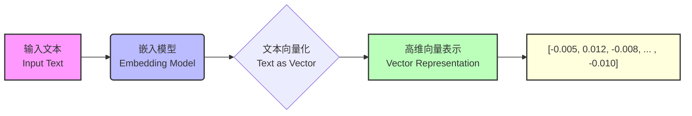

## Embedding：自然语言在计算机世界的投影

从最终的结果来看，文本的Embedding，就是将原先的自然语言符号转化为一个高维数组。

众所周知，本质上来说，计算机识别0/1二进制代表的对象，而无法直接理解自然语言的含义。因此，要让计算机识别语句含义（主要是语句之间的语义关联性），则需要将原本的自然语言投射到一个高维空间，并用一个数组对其进行表示。




> 计算机只能够识别二进制数据，即0和1的序列。但是，它可以通过特定的二进制编码方案来表示和处理浮点数（即带小数点的数）。这种编码方案通常遵循一种称为IEEE浮点数标准的规则。

其实不仅仅是Embedding，我们对于任何事物的认识，其实也都是源于一些维度的信息。

例如，例如我们对一个人的认识可以有如下一些角度（维度）：
- 粗粒度：性别、年龄、外貌、性格等；
- 细粒度：身高、体重、头发长短、是否有单双眼皮；

人类凭借感官和直觉可以轻松地识别和区分个体之间的差异，这种能力对我们来说几乎是本能的。但如果想让计算机执行同样的识别任务，情况就会变得复杂。计算机没有感官，它们依赖于算法和数据处理来模拟这一过程。因为计算机只能识别和处理二进制数据，那么我们可以将一个人表示为`[30岁,身高180cm, 体重70kg]`。在这里：
- 每个特征代表一个维度，比如年龄、身高、体重，在数学上称之为**多维**，
- 年龄、身高和体重这样的特征可以在一个连续的范围内取值，比如年龄可以是任意一个实数，在数学上称之为**连续的**。

进而我们就可以这样理解：
- 包含多个特征的这个列表，叫做**多维空间**，
- 描述这个人特征的这一串数字，叫做**连续向量**。
所以一个人在计算机中的表示，就是一个多维空间的连续向量。

例如在极简情况下，我们假设某人`[30岁,身高180cm, 体重70kg]`的表示如下，这里的`p1` 就是这个人在计算机世界里的高维信息投射：

```python
p1 = [30, 180, 70]
```

## 基于 Embedding 的相似度挖掘

不同于人类拥有一些天然的基于某些规则的客观的评判标准，计算机对于样本空间中的点的认识源于不同点之间的相互关系。

例如基于某些评判标准，我们会认为28岁、180cm、200kg的人的体重过重，而35岁、170、75kg的体重则相对正常。但对于计算机来说，以上三个人的信息都只是当前样本空间中的三个点，而在初始情况下，计算机并不能判断谁的体重超标，而只能简单判断哪些样本点之间的关联性更大。然后再在基于外部规则的情况下，将关联性结果转化为更有针对性的结论。这里我们先将刚才所说的两个人的基本情况转化为样本空间中的另外两个点：

```python
p2 = [28, 180, 200]
p3 = [35, 170, 75]
```

**要看两个人或两段文本的是否是相似的，我们可以比较它们的这个多维空间中的连续向量。这种比较通常是通过计算向量间的距离来实现的（比如测量这个空间中两点之间的直线距离），距离越小，表明两个向量在多维空间中越接近，即这两个人或文本在多个特征上更相似，从而实现最相似的文本匹配。这种基于距离的比较就是量化相似度的关键。因此，整体向量的相似度可以看作是在多个维度上特征相似性的综合体现。这就是所谓的Embedding**，它是一种将文本转换为多维空间中的连续向量的方法，通过计算这些点之间的距离来判断文本之间的相似性。距离越近表示两段文本越相似，距离越远则意味着它们的差异越大。

```python
# 计算距离
distance_p1_p2 = np.linalg.norm(p1 - p2)
distance_p1_p3 = np.linalg.norm(p1 - p3)
distance_p2_p3 = np.linalg.norm(p2 - p3)

distance_p1_p2, distance_p1_p3, distance_p2_p3

// 输出
(130.01538370516005, 8.660254037844387, 125.29565036345036)
```

此时计算机能够判断p2与p1、p3相距较远，可能存在异常情况。

而实际上，当我们在使用Embedding对文本进行词向量化处理的时候，也是将其先投射到高维空间，然后再文本之间的距离，并根据距离远近进行相似度匹配。

只不过面对茫茫多的单次、句子、段落，为表示它们的语义，需要在高维空间表示其含义，这个在高维空间投射过程远比我们上面看到的只通过三个维度来统计各人信息要复杂的多。

接下来，我们先从Embedding的鼻祖、也就是相对更加熟悉的One-hot独热编码开始介绍，One-Hot是文本词向量化早期尝试的方法，而促使Embedding技术出现的原因，也主要是为了解决One-Hot编码存在的限制和不足。

## One-Hot 独热编码: 文本向量化初探

围绕文本向量化，大家首先想到的方法就是借助 One-Hot 方法对每个单词进行编码。其**核心思想是在一个固定大小的词库中，为每个单词分配一个唯一的、稀疏的二进制向量（0或1），其中仅有一个元素是1（对应该单词在词库中的位置），而所有其他元素都是 0。

### 文本对象的 One-hot 编码过程

假设现在有一句话：“苹果很好吃，我喜欢苹果”。如果用 `One-Hot` 编码，One-hot 编码步骤如下：


上图就是`One-Hot`编码实现文本向量化的过程，针对`One-Hot`编码，有几个关键点需要重点理解：
1. *词汇表的唯一性**：为确保每个词都有一个与之对应的唯一词表示，首先需要知道句子中有多少种不同的词。在例句“苹果很好吃，我喜欢苹果”中，尽管有5个词，但**只有“苹果”，“很”，“好吃”，“我”，“喜欢” 是不重复的，最终形成包含这些词的词汇表，词汇表大小为词表元素的个数，即vocab_size=5**；
2. **词表示长度**：每个词表示的长度等于词汇表的大小。在这里，因为词汇表有5个不同的词，所以每个词表示的长度为5；
3. **编码方式**： 对于每个词，其对应的词表示在与该词匹配的位置上为 1，而在其他位置上为 0。因此，“苹果”被编码为[1, 0, 0, 0, 0]，“很”被编码为[0, 1, 0, 0, 0]，“好吃”被编码为[0, 0, 1, 0, 0]，依此类推；
4. **输出形式**：经过One-Hot编码处理后，数据被构造成一个矩阵（句子表示），其中矩阵的每一行对应输入文本中的每个词的编码，而每一列映射到词汇表中的唯一词

**这个矩阵（句子表示）是对文本进行数字化表示的直观方式，使我们能够将文本数据输入到各种计算模型中。每个词表示明确地标识了它在词汇表中的位置，从而能够确保One-Hot编码的唯一性**。

能够发现，One-Hot的编码过程确实非常简单，但它也引出了一系列问题，主要包括以下几点：
1. 高纬度问题。
2. 稀疏性问题。
3. 内存消耗问题。

### 从One-Hot编码来看文本相似度衡量方法

尽管 One-hot 在文本编码过程中存在诸多问题，但人们在长期使用 One-hot 进行编码的过程中，仍然探索得到了非常重要的用于衡量文本相似度的方法——余弦相似度。不同于欧式距离用于计算样本之间的距离，余弦相似度侧重于计算样本之间方向是否一致。

这两种衡量方法中，欧式距离更容易受到文本长度影响而无法获得准确的语义判别结果，而余弦相似度则可以很好的排除文本长度影响，更容易正确识别文本长度不同但表意类似的语句。因此在实际使用中，余弦相似度是更为通用的用于衡量文本相似度的方法。

#### 欧氏距离与余弦相似度计算公式

两种不同的衡量距离的方法计算过程如下。假设现有a、b两个向量：

$$
    \vec{a} = [a_1, a_2, a_3, ...]
$$

$$
    \vec{b} = [b_1, b_2, b_3, ...]
$$

那么欧氏距离计算公式为：

$$
\text{Euclidean Distance} (\vec{a}, \vec{b}) = \sqrt{\sum_{i=1}^{n} (a_i - b_i)^2}$$

类似的，余弦相似度计算公式为：

$$
\text{Cosine Similarity} (\vec{a}, \vec{b}) = \frac{\vec{a} \cdot \vec{b}}{\|\vec{a}\| \|\vec{b}\|}
$$

其中：
- $\vec{a} \cdot \vec{b}$ 表示向量 $\vec{a}$ 和向量 $\vec{b}$ 的点积。
- $\|\vec{a}\|$ 和 $\|\vec{b}\|$ 分别是向量 $\vec{a}$ 和 $\vec{b}$ 的模（长度）。

点积 (Dot Product) 定义为：

$$
\vec{a} \cdot \vec{b} = a_1b_1 + a_2b_2 + \ldots + a_nb_n
$$

向量的模 (Magnitude) 定义为：

$$
\|\vec{a}\| = \sqrt{a_1^2 + a_2^2 + \ldots + a_n^2}
$$

$$
\|\vec{b}\| = \sqrt{b_1^2 + b_2^2 + \ldots + b_n^2}
$$

例如，余弦相似度可以通过以下方式进行计算和呈现：

```python
import matplotlib.pyplot as plt
import numpy as np

# 创建两个向量
a = np.array([0, 1])
b = np.array([1, 1])

# 计算两个向量的余弦相似度
cosine_similarity = np.dot(a, b) / (np.linalg.norm(a) * np.linalg.norm(b))

# 绘制向量
plt.quiver(0, 0, a[0], a[1], angles='xy', scale_units='xy', scale=1, color='r')
plt.quiver(0, 0, b[0], b[1], angles='xy', scale_units='xy', scale=1, color='b')

# 设置图表属性
plt.xlim(-0.5, 1.5)
plt.ylim(-0.5, 1.5)
plt.grid()
plt.title(f'Cosine Similarity: {cosine_similarity:.2f}')
plt.xlabel('X axis')
plt.ylabel('Y axis')

# 添加图例
plt.legend(['Vector a', 'Vector b'])

# 显示图表
plt.show()
```

这幅图展示了二维空间中两个向量的方向。红色向量代表 $\vec{a}$ ，蓝色向量代表 $\vec{b}$  。它们之间的夹角表示了两个向量的余弦相似度。余弦相似度是通过计算两个向量的点积并除以它们各自的范数（即长度）来得到的。在这个示例中，这两个向量的余弦相似度大约为 0.71，意味着它们在方向上有一定程度的相似性。这个值越接近 1，表示两个向量的方向越相似。

而相比之下，欧式距离的计算过程就要简单很多：

```python
from sklearn.metrics.pairwise import cosine_similarity, euclidean_distances
# 计算欧氏距离
a = np.array([[0, 1]])
b = np.array([[1, 1]])
euclidean_dist = euclidean_distances(a, b)
euclidean_dist

# 输出
array([[1.]])
```

#### 余弦相似度和欧式距离在衡量文本相似度之间的差异

接下来，我们就进一步测试余弦相似度和欧式距离在衡量文本相似度之间的差异。这里我准备了三段文本，分别是
- "我喜欢吃苹果"
- "苹果是我最喜欢吃的水果"
- "我喜欢用苹果手机"。

很明显，从语义上来看，第一句和第二局表达的是相同含义，但表述方式不同，这两句句式有较大区别，而相比之下，第一句和第三局表意完全不同，但表述格式高度类似。在这种情况下，欧氏距离更容易收到句式的影响而发生误判，而余弦相似度则有更好的捕获类似表意语句的能力：

```
(array([[1.        , 0.70710678, 0.67082039],
        [0.70710678, 1.        , 0.47434165],
        [0.67082039, 0.47434165, 1.        ]]),
 array([[0.        , 2.        , 1.73205081],
        [2.        , 0.        , 2.64575131],
        [1.73205081, 2.64575131, 0.        ]]))
```

```python
print(encoder.fit_transform([[word] for word in vocab]))
```

```Response
  (0, 4)	1.0
  (1, 0)	1.0
  (2, 3)	1.0
  (3, 8)	1.0
  (4, 5)	1.0
  (5, 6)	1.0
  (6, 9)	1.0
  (7, 2)	1.0
  (8, 7)	1.0
  (9, 1)	1.0
```

在这个例子中，我首先对三个句子进行了 One-Hot 编码，然后分别计算了它们之间的余弦相似度和欧几里得距离。结果如下：       
- 余弦相似度计算结果：        
    - 句子1（"我喜欢吃苹果"）与句子2（"苹果是我最喜欢吃的水果"）的余弦相似度：0.7071
    - 句子1（"我喜欢吃苹果"）与句子3（"我喜欢用苹果手机"）的余弦相似度：0.6708
    - 句子2（"苹果是我最喜欢吃的水果"）与句子3（"我喜欢用苹果手机"）的余弦相似度：0.4743       
- 欧几里得距离：
    - 句子1（"我喜欢吃苹果"）与句子2（"苹果是我最喜欢吃的水果"）的欧几里得距离：2.0
    - 句子1（"我喜欢吃苹果"）与句子3（"我喜欢用苹果手机"）的欧几里得距离：1.7
    - 句子2（"苹果是我最喜欢吃的水果"）与句子3（"我喜欢用苹果手机"）的欧几里得距离：2.745

欧几里得距离考虑了向量的大小和维度差异，句子1和句子3之间的距离较小，表明在特征空间中它们相对更接近。而余弦相似度专注于向量的方向，忽略了它们的大小最终获得了更准确的判别效果。

> 欧式距离越小则代表越接近（相似），而余弦相似度则是越接近1代表越相似。

当然，除了One-Hot之外，早期文本编码方法中还有一个非常有名的方法：TF-IDF，逆向词频统计。不同于One-Hot是把每句话中每个单次出现的次数进行统计，TF-IDF会对高频词汇进行“逆向统计”，即会压缩其取值重要性。从本质上来说，该方法也是一种简单的文本编码方式，并未从根本上解决One-Hot编码带来的一系列问题。

尽管One-Hot编码的这些问题和局限性是显而易见的，但为了解决这些问题却花费了数十年的时间，这个过程不仅涉及了自然语言处理（NLP）领域的发展，还包括机器学习和深度学习技术的进步。

早期有研究者开始使用基于统计的方法来尝试捕捉词之间的共现信息。然而，这些方法通常仍然无法完全捕获词义的复杂性。直到神经网络的出现才让捕获语义复杂关系变得可能，更具体来说，是大规模复杂神经网络 Word2Vec 的出现，才很好的解决了这个问题。


## Word2Vec：Embedding技术的里程碑
