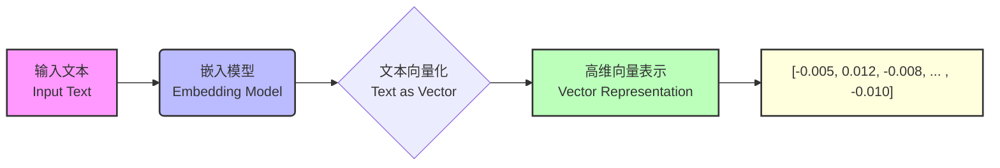

## Embedding：自然语言在计算机世界的投影

从最终的结果来看，文本的Embedding，就是将原先的自然语言符号转化为一个高维数组。

众所周知，本质上来说，计算机识别0/1二进制代表的对象，而无法直接理解自然语言的含义。因此，要让计算机识别语句含义（主要是语句之间的语义关联性），则需要将原本的自然语言投射到一个高维空间，并用一个数组对其进行表示。




> 计算机只能够识别二进制数据，即0和1的序列。但是，它可以通过特定的二进制编码方案来表示和处理浮点数（即带小数点的数）。这种编码方案通常遵循一种称为IEEE浮点数标准的规则。

其实不仅仅是Embedding，我们对于任何事物的认识，其实也都是源于一些维度的信息。

例如，例如我们对一个人的认识可以有如下一些角度（维度）：
- 粗粒度：性别、年龄、外貌、性格等；
- 细粒度：身高、体重、头发长短、是否有单双眼皮；

人类凭借感官和直觉可以轻松地识别和区分个体之间的差异，这种能力对我们来说几乎是本能的。但如果想让计算机执行同样的识别任务，情况就会变得复杂。计算机没有感官，它们依赖于算法和数据处理来模拟这一过程。因为计算机只能识别和处理二进制数据，那么我们可以将一个人表示为`[30岁,身高180cm, 体重70kg]`。在这里：
- 每个特征代表一个维度，比如年龄、身高、体重，在数学上称之为**多维**，
- 年龄、身高和体重这样的特征可以在一个连续的范围内取值，比如年龄可以是任意一个实数，在数学上称之为**连续的**。

进而我们就可以这样理解：
- 包含多个特征的这个列表，叫做**多维空间**，
- 描述这个人特征的这一串数字，叫做**连续向量**。
所以一个人在计算机中的表示，就是一个多维空间的连续向量。

例如在极简情况下，我们假设某人`[30岁,身高180cm, 体重70kg]`的表示如下，这里的`p1` 就是这个人在计算机世界里的高维信息投射：

```python
p1 = [30, 180, 70]
```

## 基于 Embedding 的相似度挖掘

不同于人类拥有一些天然的基于某些规则的客观的评判标准，计算机对于样本空间中的点的认识源于不同点之间的相互关系。

例如基于某些评判标准，我们会认为28岁、180cm、200kg的人的体重过重，而35岁、170、75kg的体重则相对正常。但对于计算机来说，以上三个人的信息都只是当前样本空间中的三个点，而在初始情况下，计算机并不能判断谁的体重超标，而只能简单判断哪些样本点之间的关联性更大。然后再在基于外部规则的情况下，将关联性结果转化为更有针对性的结论。这里我们先将刚才所说的两个人的基本情况转化为样本空间中的另外两个点：

```python
p2 = [28, 180, 200]
p3 = [35, 170, 75]
```

**要看两个人或两段文本的是否是相似的，我们可以比较它们的这个多维空间中的连续向量。这种比较通常是通过计算向量间的距离来实现的（比如测量这个空间中两点之间的直线距离），距离越小，表明两个向量在多维空间中越接近，即这两个人或文本在多个特征上更相似，从而实现最相似的文本匹配。这种基于距离的比较就是量化相似度的关键。因此，整体向量的相似度可以看作是在多个维度上特征相似性的综合体现。这就是所谓的Embedding**，它是一种将文本转换为多维空间中的连续向量的方法，通过计算这些点之间的距离来判断文本之间的相似性。距离越近表示两段文本越相似，距离越远则意味着它们的差异越大。

```python
# 计算距离
distance_p1_p2 = np.linalg.norm(p1 - p2)
distance_p1_p3 = np.linalg.norm(p1 - p3)
distance_p2_p3 = np.linalg.norm(p2 - p3)

distance_p1_p2, distance_p1_p3, distance_p2_p3

// 输出
(130.01538370516005, 8.660254037844387, 125.29565036345036)
```

此时计算机能够判断p2与p1、p3相距较远，可能存在异常情况。

而实际上，当我们在使用Embedding对文本进行词向量化处理的时候，也是将其先投射到高维空间，然后再文本之间的距离，并根据距离远近进行相似度匹配。

只不过面对茫茫多的单次、句子、段落，为表示它们的语义，需要在高维空间表示其含义，这个在高维空间投射过程远比我们上面看到的只通过三个维度来统计各人信息要复杂的多。

接下来，我们先从Embedding的鼻祖、也就是相对更加熟悉的One-hot独热编码开始介绍，One-Hot是文本词向量化早期尝试的方法，而促使Embedding技术出现的原因，也主要是为了解决One-Hot编码存在的限制和不足。

## One-Hot 独热编码: 文本向量化初探

围绕文本向量化，大家首先想到的方法就是借助 One-Hot 方法对每个单词进行编码。其**核心思想是在一个固定大小的词库中，为每个单词分配一个唯一的、稀疏的二进制向量（0或1），其中仅有一个元素是1（对应该单词在词库中的位置），而所有其他元素都是 0。

### 文本对象的 One-hot 编码过程

假设现在有一句话：“苹果很好吃，我喜欢苹果”。如果用 `One-Hot` 编码，One-hot 编码步骤如下：


上图就是`One-Hot`编码实现文本向量化的过程，针对`One-Hot`编码，有几个关键点需要重点理解：
1. *词汇表的唯一性**：为确保每个词都有一个与之对应的唯一词表示，首先需要知道句子中有多少种不同的词。在例句“苹果很好吃，我喜欢苹果”中，尽管有5个词，但**只有“苹果”，“很”，“好吃”，“我”，“喜欢” 是不重复的，最终形成包含这些词的词汇表，词汇表大小为词表元素的个数，即vocab_size=5**；
2. **词表示长度**：每个词表示的长度等于词汇表的大小。在这里，因为词汇表有5个不同的词，所以每个词表示的长度为5；
3. **编码方式**： 对于每个词，其对应的词表示在与该词匹配的位置上为 1，而在其他位置上为 0。因此，“苹果”被编码为[1, 0, 0, 0, 0]，“很”被编码为[0, 1, 0, 0, 0]，“好吃”被编码为[0, 0, 1, 0, 0]，依此类推；
4. **输出形式**：经过One-Hot编码处理后，数据被构造成一个矩阵（句子表示），其中矩阵的每一行对应输入文本中的每个词的编码，而每一列映射到词汇表中的唯一词

**这个矩阵（句子表示）是对文本进行数字化表示的直观方式，使我们能够将文本数据输入到各种计算模型中。每个词表示明确地标识了它在词汇表中的位置，从而能够确保One-Hot编码的唯一性**。

能够发现，One-Hot的编码过程确实非常简单，但它也引出了一系列问题，主要包括以下几点：
1. 高纬度问题。
2. 稀疏性问题。
3. 内存消耗问题。

### 从One-Hot编码来看文本相似度衡量方法

尽管 One-hot 在文本编码过程中存在诸多问题，但人们在长期使用 One-hot 进行编码的过程中，仍然探索得到了非常重要的用于衡量文本相似度的方法——余弦相似度。不同于欧式距离用于计算样本之间的距离，余弦相似度侧重于计算样本之间方向是否一致。

这两种衡量方法中，欧式距离更容易受到文本长度影响而无法获得准确的语义判别结果，而余弦相似度则可以很好的排除文本长度影响，更容易正确识别文本长度不同但表意类似的语句。因此在实际使用中，余弦相似度是更为通用的用于衡量文本相似度的方法。

#### 欧氏距离与余弦相似度计算公式

两种不同的衡量距离的方法计算过程如下。假设现有a、b两个向量：

$$
    \vec{a} = [a_1, a_2, a_3, ...]
$$

$$
    \vec{b} = [b_1, b_2, b_3, ...]
$$

那么欧氏距离计算公式为：

$$
\text{Euclidean Distance} (\vec{a}, \vec{b}) = \sqrt{\sum_{i=1}^{n} (a_i - b_i)^2}$$

类似的，余弦相似度计算公式为：

$$
\text{Cosine Similarity} (\vec{a}, \vec{b}) = \frac{\vec{a} \cdot \vec{b}}{\|\vec{a}\| \|\vec{b}\|}
$$

其中：
- $\vec{a} \cdot \vec{b}$ 表示向量 $\vec{a}$ 和向量 $\vec{b}$ 的点积。
- $\|\vec{a}\|$ 和 $\|\vec{b}\|$ 分别是向量 $\vec{a}$ 和 $\vec{b}$ 的模（长度）。

点积 (Dot Product) 定义为：

$$
\vec{a} \cdot \vec{b} = a_1b_1 + a_2b_2 + \ldots + a_nb_n
$$

向量的模 (Magnitude) 定义为：

$$
\|\vec{a}\| = \sqrt{a_1^2 + a_2^2 + \ldots + a_n^2}
$$

$$
\|\vec{b}\| = \sqrt{b_1^2 + b_2^2 + \ldots + b_n^2}
$$

例如，余弦相似度可以通过以下方式进行计算和呈现：

```python
import matplotlib.pyplot as plt
import numpy as np

# 创建两个向量
a = np.array([0, 1])
b = np.array([1, 1])

# 计算两个向量的余弦相似度
cosine_similarity = np.dot(a, b) / (np.linalg.norm(a) * np.linalg.norm(b))

# 绘制向量
plt.quiver(0, 0, a[0], a[1], angles='xy', scale_units='xy', scale=1, color='r')
plt.quiver(0, 0, b[0], b[1], angles='xy', scale_units='xy', scale=1, color='b')

# 设置图表属性
plt.xlim(-0.5, 1.5)
plt.ylim(-0.5, 1.5)
plt.grid()
plt.title(f'Cosine Similarity: {cosine_similarity:.2f}')
plt.xlabel('X axis')
plt.ylabel('Y axis')

# 添加图例
plt.legend(['Vector a', 'Vector b'])

# 显示图表
plt.show()
```

这幅图展示了二维空间中两个向量的方向。红色向量代表 $\vec{a}$ ，蓝色向量代表 $\vec{b}$  。它们之间的夹角表示了两个向量的余弦相似度。余弦相似度是通过计算两个向量的点积并除以它们各自的范数（即长度）来得到的。在这个示例中，这两个向量的余弦相似度大约为 0.71，意味着它们在方向上有一定程度的相似性。这个值越接近 1，表示两个向量的方向越相似。

而相比之下，欧式距离的计算过程就要简单很多：

```python
from sklearn.metrics.pairwise import cosine_similarity, euclidean_distances
# 计算欧氏距离
a = np.array([[0, 1]])
b = np.array([[1, 1]])
euclidean_dist = euclidean_distances(a, b)
euclidean_dist

# 输出
array([[1.]])
```

#### 余弦相似度和欧式距离在衡量文本相似度之间的差异

接下来，我们就进一步测试余弦相似度和欧式距离在衡量文本相似度之间的差异。这里我准备了三段文本，分别是
- "我喜欢吃苹果"
- "苹果是我最喜欢吃的水果"
- "我喜欢用苹果手机"。

很明显，从语义上来看，第一句和第二局表达的是相同含义，但表述方式不同，这两句句式有较大区别，而相比之下，第一句和第三局表意完全不同，但表述格式高度类似。在这种情况下，欧氏距离更容易收到句式的影响而发生误判，而余弦相似度则有更好的捕获类似表意语句的能力：

```
(array([[1.        , 0.70710678, 0.67082039],
        [0.70710678, 1.        , 0.47434165],
        [0.67082039, 0.47434165, 1.        ]]),
 array([[0.        , 2.        , 1.73205081],
        [2.        , 0.        , 2.64575131],
        [1.73205081, 2.64575131, 0.        ]]))
```

```python
print(encoder.fit_transform([[word] for word in vocab]))
```

```Response
  (0, 4)	1.0
  (1, 0)	1.0
  (2, 3)	1.0
  (3, 8)	1.0
  (4, 5)	1.0
  (5, 6)	1.0
  (6, 9)	1.0
  (7, 2)	1.0
  (8, 7)	1.0
  (9, 1)	1.0
```

在这个例子中，我首先对三个句子进行了 One-Hot 编码，然后分别计算了它们之间的余弦相似度和欧几里得距离。结果如下：       
- 余弦相似度计算结果：        
    - 句子1（"我喜欢吃苹果"）与句子2（"苹果是我最喜欢吃的水果"）的余弦相似度：0.7071
    - 句子1（"我喜欢吃苹果"）与句子3（"我喜欢用苹果手机"）的余弦相似度：0.6708
    - 句子2（"苹果是我最喜欢吃的水果"）与句子3（"我喜欢用苹果手机"）的余弦相似度：0.4743       
- 欧几里得距离：
    - 句子1（"我喜欢吃苹果"）与句子2（"苹果是我最喜欢吃的水果"）的欧几里得距离：2.0
    - 句子1（"我喜欢吃苹果"）与句子3（"我喜欢用苹果手机"）的欧几里得距离：1.7
    - 句子2（"苹果是我最喜欢吃的水果"）与句子3（"我喜欢用苹果手机"）的欧几里得距离：2.745

欧几里得距离考虑了向量的大小和维度差异，句子1和句子3之间的距离较小，表明在特征空间中它们相对更接近。而余弦相似度专注于向量的方向，忽略了它们的大小最终获得了更准确的判别效果。

> 欧式距离越小则代表越接近（相似），而余弦相似度则是越接近1代表越相似。

当然，除了One-Hot之外，早期文本编码方法中还有一个非常有名的方法：TF-IDF，逆向词频统计。不同于One-Hot是把每句话中每个单次出现的次数进行统计，TF-IDF会对高频词汇进行“逆向统计”，即会压缩其取值重要性。从本质上来说，该方法也是一种简单的文本编码方式，并未从根本上解决One-Hot编码带来的一系列问题。

尽管One-Hot编码的这些问题和局限性是显而易见的，但为了解决这些问题却花费了数十年的时间，这个过程不仅涉及了自然语言处理（NLP）领域的发展，还包括机器学习和深度学习技术的进步。

早期有研究者开始使用基于统计的方法来尝试捕捉词之间的共现信息。然而，这些方法通常仍然无法完全捕获词义的复杂性。直到神经网络的出现才让捕获语义复杂关系变得可能，更具体来说，是大规模复杂神经网络 Word2Vec 的出现，才很好的解决了这个问题。


### Word2Vec：Embedding技术的里程碑

Word2Vec 是由 Google 的研究团队 Tomas Mikolov 在 2013 年推出，标志着自然语言处理（NLP）领域词嵌入技术的重要转折点。

Word2Vec 引入流一种全新的思维方式来理解单词和文本，与传统词表示法如 One-Hot 编码相比，Word2Vec 能否将单词转化为多维空间中的向量，这些向量在捕捉词之间的语义和语法关系方面表现出色。

Word2Vec 核心思想基于一个假设：词的含义通过其上下文来定义。主要包含两种结构：
1. Continuous Bag of Worlds，CBOW
2. Skip-Gram
CBOW 模型通过上下文预测当前词，而Skip-Gram则恰好相反，通过当前词预测其上下文。二者皆通过神经网络模型实现，有效利用大量未标记的文本数据。

Word2Vec 的推出对 NLP 领域产生来深远影响：
1. 大大改善了许多基于文本的应用，包括文本分类、情感分析和机器翻译。
2. 为后续的词嵌入技术，如 Glove 和 FastText, 甚至更先进的上下文相关嵌入模型（如 BERT 和 GPT）奠定了基础。
这些模型在处理复杂的语义模式、捕捉词义的细微差别方面进一步提升来 Word2Vec 的概念。

Word2Vec 的诞生不仅仅是 NLP 领域的一个重要里程碑，更是整个机器学习和人工智能领域的一次重大革新。它的出现标志者从基于规则的语言处理向基于学习的语言处理的转变，为理解和处理人类语言开辟来新的可能性。


### World2Vec 训练过程

与现在的预训练大模型类似，Worl2Vec 并不是通过**有监督学习**得到的，而是一种**无监督学习**技术。它不需要标记的训练数据（如分类标签或其他标注信息），而是直接从文本数据中学习单词的表示。

下面是描述 Word2Vec 模型训练过程的描述：
1. **收集文本数据**： 训练开始于收集大量的文本数据，这些数据可以是书籍、文章、网页等任何形式的文字。
2. **分词处理**： 将这些文本数据分割成单词。例如 “i like apples” 会被分割成 "i"、"like"、"apples"。
3. **选择模型**： 有2种模型可供选择，CBOW（连续词袋）和 Skip-Gram
    - CBOW：这个模型试图根据一个词周围的上下文来预测这个词。比如：给定 "I...apples"，它会尝试填充中间的词。
    - Skip-Gram: 与 CBOW 相反，它根据一个词来预测其上下文。比如：给定 “like”, 它会尝试预测 “i” 和 “apples”
4. **创建神经网络**： Word2Vec 通过创建一个简单的神经网络来实现这一过程。这个网络不像传统的用于分类的神经网络那样复杂，它的目标是学习单词的嵌入。
5. **训练过程**: 
    - 网络通过观察大量的上下文-单词配对来进行训练。例如，在 Skip-Gram 模型中，如果我们看到 "I like apples"，那么 ("like", "I") 和 ("like", "apples") 就是训练样本。
    - 通过这种方式，网络逐渐学习到单词的有效表示。这些表示捕捉了单词间的许多语义关系，例如同义词、反义词等。
6. **得到词向量**：训练完成后，每个单词都会被转化为一个向量（即一系列数字）。这些向量就是我们所说的词嵌入，它们包含了关于这些词的丰富信息。

总的来说，Word2Vec 是通过观察单词及其上下文的大量实例，无需任何人工标记的信息，来学习词汇的数学表示的一种方法。这些表示在处理自然语言时非常有用，因为它们捕捉了单词之间的复杂关系。

### Word2Vec极简使用过程

下面是尝试调用WordsVec模型，并借此观察稠密词向量创建结果。这里假设令其创建一个100个维度的词向量（对于Word2Vec来说是可以规定词向量维度），仍然还是衡量"我喜欢吃苹果", "苹果是我最喜欢吃的水果", "我喜欢用苹果手机"三句话关联度，WordsVec模型的词向量化计算过程如下：

```python
```

能够发现，WordsVec模型能够非常好的计算得到1、2句话关联性较强的结论。而每句话的词向量如下所示：

```python
sentence_vectors
```

```python
sentence_vectors[0]
```

```python
len(sentence_vectors[0])
```

所以一个标准的 Embedding 过程是这样的：


首先，`bovine buddies say` 这样的文本输入，经过 `Embedding model` 这个模型被转化为由一串数字组成的向量，可以从上图中清晰的看到，这个过程涉及到3个部分：
- 文本输入：这是要转化为 Embedding 的初始数据，通常包括单词或句子，标识为 Text;
- Embedding 模型：这是一个预先训练好的模型，专门用来将文本转换为向量，World2Vec 就是典型代表
- 向量输出：通过 Embedding 模型处理后，文本将被转化为一个浮点数向量，这个向量具有固定长度，如 512 或 1024 等，而其中的数值通常在 [-1, 1] 范围内，标识为 `Text as vector`。

Embedding过程可以被理解为：
- 使用训练好的 Embedding 模型将输入的单词、句子等文本信息转换为固定长度的浮点数向量列表
- 更深层次的，Embedding 技术实现了从“离散的文本序列”到“固定长度的浮点数向量”的转换任务，这种输出的向量**在有效解决One-Hot编码存在的高维度和稀疏性问题的同时，也捕获了语义的相似度**

能够发现，与 One-Hot 编码相比，Embedding的优势非常明显：
1. **稠密向量**：与 One-Hot 编码不同，经过 Embedding 得到是稠密向量，它**为每个语义特征提供一个固定长度但是所有值都是不完全为0的向量，这些值通常是连续的浮点数**。
2. **低维表示**：**Embedding 通常是低维的**，比如512、1024、2048维，远少于基于One-Hot的编码表示。
3. **可以捕捉语义关系**：Embedding的关键优势在于，**相似的词或在语义上相关的词在 Embedding 空间中会被映射到接近的位置**。 比如“cat”和“kitten”的Embedding编码之间的相似度比“cat”和“car” 向量在Embeding空间中更加接近，因为它们在语义上具有相似性。
4. **基于上下文的训练**：**大多数Embedding模型是通过大量的文本数据训练而来**，如`Word2Vec`、`GloVe`或`FastText`。这些模型通常会根据单词的上下文（即其在文本中的邻近词汇）来学习其向量表示。
5. **转移学习**：**一旦训练好，Embedding 可以被直接用于各种NLP任务，如文本分类、情感分析等**。这是因为这些 Embedding 向量捕捉了词汇的语义信息，这些信息在多个任务中都是有用的。
6. **支持微调**：在某些任务中，**预训练的Embedding模型可以在特定的任务数据上进一步微调**，以更好地适应该特定任务。

Embedding 在多个层面上解决了One-Hot 编码的瓶颈，尽管方法不同，但其目标都是一致的，就是要将原始输入数据转化为数值向量，以便计算机能够处理。然而大家有没有考虑过：计算机是能够识别了，但是我们却看不懂了。不论是经过 One-Hot Encoding， 还是 Embedding 的数据，这种编码形式的输出对我们来说都是不直观，且不容易理解的，这就引出了一个关键性的思考：我们是否能够从这些数值向量表示中恢复原始的自然语言或其他类型的数据呢？<

这个问题实质上涉及到编码的“可逆性”。

## 编码的可逆性

首先，**One-Hot编码是“可逆”的**，也就是说，如果有一个分类变量，并且对它进行 One-Hot 编码后，我们可以直接从编码后的向量还原回原始的分类变量值。因为在 One-Hot 编码的向量中，只有一个元素的值为1，其余都是0，这个"1"的位置直接对应了原始分类变量的一个特定值。

例如，考虑有这样一个词表：['红', '绿', '蓝']。从 One-Hot 编码的向量 `[0, 1, 0]`，我们可以直接推断原始的颜色是"绿"，因为在向量的第二个位置上有一个"1"。

而**对于 Embedding 来说，它是“不可逆”的**。因为 Embedding 通常是通过学习得到的，它捕获的是原始数据中复杂的语义信息，而不仅仅是原始值的编码。这就意味着从 Embedding 向量，我们不能直接还原回原始的分类变量值。

更加通俗的来理解，我们可以将 One-Hot 编码想象为一个直接的、明确的标签系统。每个词汇都有一个唯一的标签，这使得还原非常简单。而 Embedding 更像是一个描述系统，它不仅包含了词汇的基本意义，还包括了词与其他词之间的复杂关系和上下文中的语义信息。在这里，每个词是通过一组特征来描述的，这使得还原变得复杂，因为相同的描述（或相似的Embedding）可以适用于多个不同的词汇。

正如在机器学习中，我们经常追求模型的“可解释性”，以便更好地理解模型的行为，同样地，对于数据的编码表示，了解其可逆性也是非常有价值的。

总的来说，**Embedding 的引入标志着从简单的高维、稀疏的表示方式，转向了一个更为紧凑、低维且富有语义的表示方法**。这种进步极大地推进了自然语言处理的发展，为深度学习模型提供了更强的能力去解析和生成人类的语言。而如果深入探究，与One-Hot 编码只是简单地将离散的文本序列转化为固定长度的高维稀疏矩阵不同，Embedding为我们提供了一种方法，可以将离散的文本序列转化为固定维度、连续的稠密矩阵，这一变化不仅使得数据的存储和处理更为高效，还使得模型能够捕捉到文本中更为深层次的语义信息。

## Word2Vec的静态Embedding模型特性

需要注意的是，Word2Vec本质上是一个一个静态嵌入模型，Word2Vec的核心特性是为每个单词生成一个固定的向量表示。这意味着无论一个词在文本中出现在何种上下文中，它的向量表示都保持不变。Word2Vec 模型通过学习文本数据中单词的使用模式，能够有效地捕捉和表示词汇之间的语义和语法关系。例如，语义上相似或相关的词在高维空间中的向量表示会彼此接近。

在实际使用过程中，Word2Vec优势与劣势分析如下：      

- 优势：
1. **简单高效**：静态嵌入模型相对简单，易于训练和实施。它们不需要复杂的神经网络架构，因此在训练和应用时更加高效。
2. **良好的通用性**：这些模型能够生成通用的词向量，适用于各种不同的下游 NLP 任务，如文本分类、情感分析等。
3. **词义捕捉**：尽管是静态的，这些模型仍能有效地捕捉和表示词汇之间的语义和语法关系，特别是对于频繁出现的词汇。
4. **资源友好**：与复杂的上下文相关嵌入模型相比，静态模型在资源消耗方面更为节约，适用于资源受限的应用场景。

- 劣势：
1. **缺乏上下文敏感性**：静态嵌入模型的主要劣势是无法捕捉词义的上下文变化。相同的词在不同的上下文中可能有不同的含义，而静态模型无法区分这些差异。
2. **对罕见词的处理**：静态模型在处理罕见词或特定领域的术语方面表现不佳，因为这些词在训练语料库中出现的频率可能较低。
3. **语义鲁棒性有限**：尽管能捕捉词义，静态模型在理解复杂的语言模式和精细的语义差别方面仍有局限。

总的来说，静态嵌入模型在简易性、效率和一般性方面表现出色，适合于广泛的基础 NLP 任务。然而，它们在处理复杂的上下文和细微的语义变化方面存在局限，这在一些高级的 NLP 应用中可能成为瓶颈。

> 除了 Word2Vec 模型外，常见的静态Embedding模型还有 GloVe 模型，该模型由斯坦福大学的Jeffrey Pennington、Richard Socher和Christopher Manning在2014年提出。

例如，对于以下四句话的关联性分析，Word2Vec就呈现出明显的性能不足问题："我买了一个苹果", "我买了一个苹果手机", "我买了一个橘子", "我买了一个手机"

```python
// todo
```

而相比之下，基于Transformer架构的新一代动态Embedding模型，则能够更好的根据实际上下文含义，而非机械的围绕每个单词进行固定编码，来获得更好的语义理解效果。


## 目前最通用的Embedding模型：动态Embedding模型

这些模型通常基于深度学习的架构，如 Transformer，利用大量的文本数据进行预训练。这种预训练-微调的范式极大地扩展了模型的适用性。在预训练阶段，模型学习大量通用的语言特征；在微调阶段，模型可以根据特定任务的需求进行调整，以适应不同的应用场景，从简单的文本分类到复杂的问答系统和文本生成任务。

动态嵌入模型的出现显著提升了机器对自然语言的理解能力。它们不仅能够更好地理解词和短语的含义，还能够处理长距离的依赖关系，这在传统的静态嵌入模型中是难以实现.

在当今的自然语言处理（NLP）领域，动态嵌入模型已成为最通用和强大的词表示方法之一。这类模型，代表作如 BERT（Bidirectional Encoder Representations from Transformers）和 GPT（Generative Pre-trained Transformer），通过利用深度学习和复杂的神经网络结构，提供了一种能够捕捉词在不同语境中细微语义变化的方法。不同于静态嵌入模型，动态嵌入模型生成的词向量不是固定不变的，而是根据词在特定句子中的上下文动态调整，从而反映出词在不同语境中的具体含义。

动态嵌入模型的另一个显著优势在于其预训练和微调（Fine-tuning）的框架。通过在大量语料库上进行预训练，这些模型能够学习到丰富的语言知识和模式。随后，通过在特定任务的数据集上进行微调，模型能够将这些知识应用于各种具体的下游任务，如文本分类、问答系统和机器翻译等。

动态嵌入模型在理解复杂的语言结构、捕捉长期依赖关系以及处理多义词等方面表现出色。这些特性使得它们在处理高级语言理解任务时具有显著的优势。尽管这些模型的计算成本和资源需求相对较高，但它们在提高。

```python
text_tuples = ("我买了一个苹果", "我买了一个苹果手机", "我买了一个橘子", "我买了一个手机")
res = openai.Embedding.create(
  model="text-embedding-ada-002",
  input=text_tuples,
  encoding_format="float"
)
```

## Embedding模型在NLP领域的重大作用

如今，Embedding技术作为自然语言处理的核心组件，广泛地应用于多个领域，以下为一些主要应用场景：
1. **搜索**：通过将查询字符串和文档都转化为Embedding，可以计算其之间的相似度（例如余弦相似度），返回与查询内容相关的结果，并按照相关性进行排序。这样，可以确保返回的搜索结果与用户查询更语义相关;
2. **聚类**：将文本转化为Embedding后，可以使用传统的聚类算法（如K-means）在低维空间中进行操作。由于Embedding捕获了文本的语义，所得到的聚类会更具实际意义;
3. **推荐**：Embedding可以基于用户的兴趣和项目的内容。通过计算用户Embedding和项目Embedding之间的相似度，可以推荐最相关的项目;
4. **异常检测**：在大量正常的文本数据的Embedding空间中，正常的数据点可能会聚集在一起，而异常的数据点可能会偏离这些集群。因此，Embedding可以帮助识别这些偏离正常模式的异常值;
5. **多样性测量**：在一个文本集合中，可以计算文本Embedding之间的距离或相似度，从而得到整个集合的相似度分布。这可以帮助我们了解集合中内容的多样性;
6. **分类**：根据其内容，文本Embedding可以与现有的机器学习或深度学习分类器结合使用。由于Embedding捕获了文本的语义信息，分类器能够更准确地对文本进行分类;

在大模型技术时间应用领域，Embedding的核心作用则是进行更效率或者更高层次的文本匹配，来辅助大模型进行更高效率、更有针对性的文本输入。

至此，上文呈现了一个关于Embedding模型的全景式概览。通过这个简要的介绍以增加Embedding的多样性和深度有一个初步的认识。