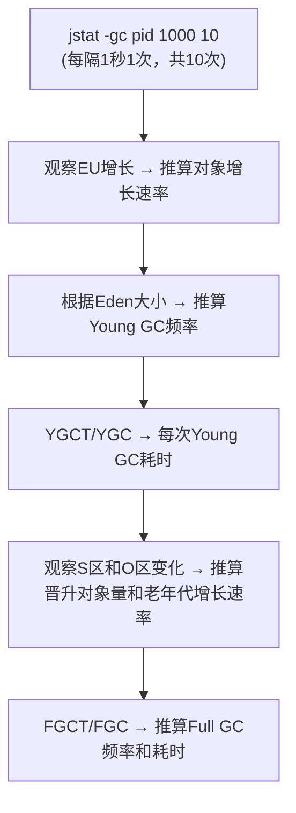
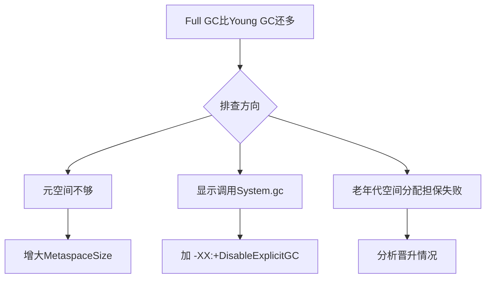
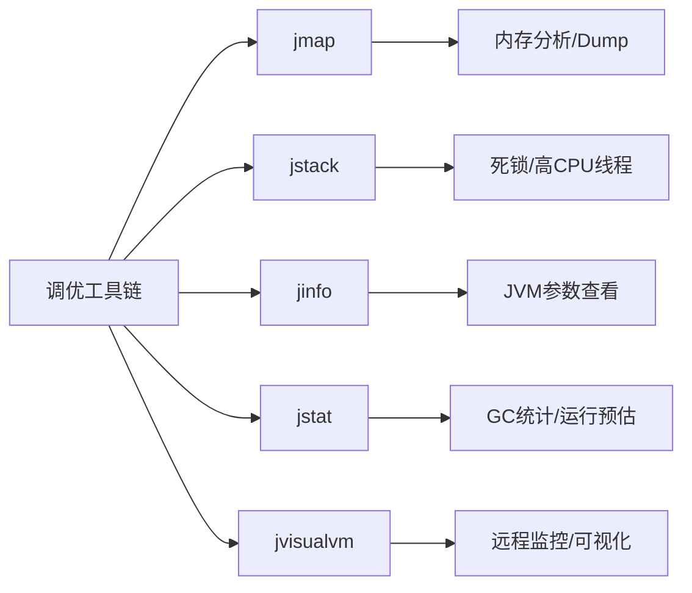

> 本文系统介绍 JDK 自带的 JVM 调优工具（jmap、jstack、jinfo、jstat、jvisualvm），并结合真实的 Full GC 频繁卡顿案例，完整演示从问题发现到定位、优化的全流程实战。

## 一、jmap — 内存查看与堆转储

### 1.1 查看内存信息

`jmap -histo <pid>` 可以查看内存信息，包括实例数量和占用空间大小。


输出格式：

| 字段 | 说明 |
|------|------|
| num | 序号 |
| instances | 实例数量 |
| bytes | 占用空间大小 |
| class name | 类名称（`[C` = char[], `[B` = byte[], `[I` = int[], `[[I` = int[][]） |

### 1.2 查看堆信息

```
jmap -heap <pid>
```


### 1.3 导出堆转储（Dump）

```bash
jmap -dump:format=b,file=eureka.hprof <pid>
```

也可以设置内存溢出时自动导出 dump 文件：

```
-XX:+HeapDumpOnOutOfMemoryError
-XX:HeapDumpPath=./   （路径）
```


**示例代码**：

```java
public class OOMTest {
    public static List<Object> list = new ArrayList<>();

    // JVM设置
    // -Xms10M -Xmx10M -XX:+PrintGCDetails -XX:+HeapDumpOnOutOfMemoryError -XX:HeapDumpPath=D:\jvm.dump
    public static void main(String[] args) {
        List<Object> list = new ArrayList<>();
        int i = 0;
        int j = 0;
        while (true) {
            list.add(new User(i++, UUID.randomUUID().toString()));
            new User(j--, UUID.randomUUID().toString());
        }
    }
}
```

可以用 **jvisualvm** 命令工具导入该 dump 文件进行分析。


---

## 二、jstack — 线程堆栈分析

### 2.1 查找死锁

```java
public class DeadLockTest {
    private static Object lock1 = new Object();
    private static Object lock2 = new Object();

    public static void main(String[] args) {
        new Thread(() -> {
            synchronized (lock1) {
                try {
                    System.out.println("thread1 begin");
                    Thread.sleep(5000);
                } catch (InterruptedException e) {}
                synchronized (lock2) {
                    System.out.println("thread1 end");
                }
            }
        }).start();

        new Thread(() -> {
            synchronized (lock2) {
                try {
                    System.out.println("thread2 begin");
                    Thread.sleep(5000);
                } catch (InterruptedException e) {}
                synchronized (lock1) {
                    System.out.println("thread2 end");
                }
            }
        }).start();
    }
}
```

执行 `jstack <pid>` 可以看到死锁信息：


```
"Thread-1" 线程名
prio=5 优先级=5
tid=0x000000001fa9e000 线程id
nid=0x2d64 线程对应的本地线程标识nid
java.lang.Thread.State: BLOCKED 线程状态
```

也可以用 **jvisualvm 自动检测死锁**：


### 2.2 远程连接 jvisualvm

**普通 Jar 程序 JMX 配置**：

```bash
java -Dcom.sun.management.jmxremote.port=8888 \
     -Djava.rmi.server.hostname=192.168.50.60 \
     -Dcom.sun.management.jmxremote.ssl=false \
     -Dcom.sun.management.jmxremote.authenticate=false \
     -jar microservice-eureka-server.jar
```

**Tomcat JMX 配置**（catalina.sh 中最后一个 JAVA_OPTS 赋值后添加）：

```bash
JAVA_OPTS="$JAVA_OPTS -Dcom.sun.management.jmxremote.port=8888 \
           -Djava.rmi.server.hostname=192.168.50.60 \
           -Dcom.sun.management.jmxremote.ssl=false \
           -Dcom.sun.management.jmxremote.authenticate=false"
```


### 2.3 找出占用 CPU 最高的线程

```java
public class Math {
    public static final int initData = 666;
    public static User user = new User();

    public int compute() {
        int a = 1;
        int b = 2;
        int c = (a + b) * 10;
        return c;
    }

    public static void main(String[] args) {
        Math math = new Math();
        while (true) {
            math.compute();  // CPU 飙高
        }
    }
}
```

**排查步骤**：

| 步骤 | 命令 | 说明 |
|------|------|------|
| 1 | `top -p <pid>` | 查看 Java 进程内存情况 |
| 2 | 按 `H` | 获取每个线程的内存情况 |
| 3 | 找到最高 TID | 如 19664 |
| 4 | 转十六进制 | 19664 → 0x4CD0 |
| 5 | `jstack <pid> \| grep -A 10 4cd0` | 获取线程堆栈后 10 行 |
| 6 | 分析堆栈 | 定位问题代码 |


---

## 三、jinfo — JVM 参数查看

查看正在运行的 Java 应用程序的扩展参数：

```bash
jinfo -flags <pid>    # 查看 JVM 参数
jinfo -sysprops <pid> # 查看 Java 系统参数
```


---

## 四、jstat — 运行时统计监控

命令格式：

```
jstat [-命令选项] [vmid] [间隔时间(毫秒)] [查询次数]
```

### 4.1 垃圾回收统计（最常用）

```
jstat -gc <pid>
```

这是**最常用**的命令，可以评估程序内存使用及 GC 压力整体情况。


| 标识 | 含义 | 标识 | 含义 |
|------|------|------|------|
| S0C | Survivor0 大小 | S1C | Survivor1 大小 |
| S0U | Survivor0 使用 | S1U | Survivor1 使用 |
| EC | Eden 区大小 | EU | Eden 区使用 |
| OC | 老年代大小 | OU | 老年代使用 |
| MC | 方法区(元空间)大小 | MU | 方法区使用 |
| CCSC | 压缩类空间大小 | CCSU | 压缩类空间使用 |
| **YGC** | **年轻代 GC 次数** | **YGCT** | **年轻代 GC 耗时(s)** |
| **FGC** | **老年代 GC 次数** | **FGCT** | **老年代 GC 耗时(s)** |
| GCT | GC 总耗时(s) | — | — |


### 4.2 其他统计命令

| 命令 | 说明 |
|------|------|
| `jstat -gccapacity <pid>` | 堆内存统计（含最小/最大容量） |
| `jstat -gcnew <pid>` | 新生代 GC 统计（含 TT、MTT、DSS） |
| `jstat -gcnewcapacity <pid>` | 新生代内存统计 |
| `jstat -gcold <pid>` | 老年代 GC 统计 |
| `jstat -gcoldcapacity <pid>` | 老年代内存统计 |
| `jstat -gcmetacapacity <pid>` | 元数据空间统计 |
| `jstat -gcutil <pid>` | 各区域使用百分比（S0/S1/E/O/M/CCS） |


### 4.3 JVM 运行情况预估

利用 `jstat -gc <pid>` 可以推算出关键指标：



**核心优化思路**：尽量让每次 Young GC 后的存活对象 < Survivor 区 50%，减少对象进入老年代，避免频繁 Full GC。

---

## 五、实战：系统频繁 Full GC 排查与优化

### 5.1 问题描述

| 项目 | 数值 |
|------|------|
| 机器配置 | 2核 4G |
| JVM 内存 | 2G |
| 运行时间 | 7 天 |
| Full GC | 500+ 次，200+ 秒 |
| Young GC | 10000+ 次，500+ 秒 |

> 日均 70+ 次 Full GC（每小时 3 次），每次约 400ms；日均 1000+ 次 Young GC（每分钟 1 次），每次约 50ms。

### 5.2 原始 JVM 参数

```
-Xms1536M -Xmx1536M -Xmn512M -Xss256K -XX:SurvivorRatio=6 -XX:MetaspaceSize=256M -XX:MaxMetaspaceSize=256M
-XX:+UseParNewGC -XX:+UseConcMarkSweepGC -XX:CMSInitiatingOccupancyFraction=75 -XX:+UseCMSInitiatingOccupancyOnly
```


### 5.3 第一步：优化 JVM 参数

怀疑是**动态对象年龄判断机制**导致 Full GC 频繁。先把年轻代适当调大：

```
-Xms1536M -Xmx1536M -Xmn1024M -Xss256K -XX:SurvivorRatio=6 -XX:MetaspaceSize=256M -XX:MaxMetaspaceSize=256M
-XX:+UseParNewGC -XX:+UseConcMarkSweepGC -XX:CMSInitiatingOccupancyFraction=92 -XX:+UseCMSInitiatingOccupancyOnly
```


**结果**：优化完发现没什么变化，Full GC 次数反而比 Young GC 还多。

### 5.4 第二步：排查可疑原因

Full GC 比 Young GC 多的可能原因：




排查后发现 Young GC 和 Full GC 依然很频繁，且有大量对象频繁被挪动到老年代。

### 5.5 第三步：jmap 定位对象

用 jmap 查看是什么对象大量产生：

```
jmap -histo <pid> | head -20
```


查到了**大量 User 对象**产生。

### 5.6 第四步：jstack 定位代码

用 jstack / jvisualvm 定位 CPU 使用较高的代码：


最终定位到的代码：

```java
@RestController
public class IndexController {

    @RequestMapping("/user/process")
    public String processUserData() throws InterruptedException {
        ArrayList<User> users = queryUsers();
        for (User user : users) {
            System.out.println("user:" + user.toString());
        }
        return "end";
    }

    // 问题代码：一次查询 5000 个 User 对象！
    private ArrayList<User> queryUsers() {
        ArrayList<User> users = new ArrayList<>();
        for (int i = 0; i < 5000; i++) {
            users.add(new User(i, "zhuge"));
        }
        return users;
    }
}
```

> **根本原因**：一次查询出大量对象，这些朝生夕死的对象频繁触发 Full GC。

### 5.7 优化方案

| 层面 | 措施 |
|------|------|
| **JVM 参数** | 调大年轻代 + 调高晋升阈值 + 禁用显式 GC |
| **代码层面** | 限制批量查询数量，分页处理，消除朝生夕死对象 |


---

## 六、内存泄露案例

电商架构中使用多级缓存（Redis + JVM 级缓存），有些同学直接使用 HashMap 不断往里面放数据却没考虑容量限制，导致缓存 Map 越来越大一直占用老年代空间，时间长了就会导致频繁 Full GC甚至 OOM。

> **解决方案**：使用成熟的 JVM 级缓存框架（如 Ehcache），自带 LRU 数据淘汰算法，自动管理缓存容量。


---

## 七、总结



| 问题类型 | 使用工具 | 排查步骤 |
|------|------|------|
| **OOM / 内存高** | jmap + jvisualvm | `-histo` 查对象分布 → dump 分析 |
| **死锁** | jstack | 直接查看线程 BLOCKED 状态 |
| **CPU 飙高** | top + jstack | top -H 找线程 → jstack 分析堆栈 |
| **频繁 Full GC** | jstat + jmap + jstack | gc 统计 → 对象分析 → 代码定位 |
| **JVM 参数确认** | jinfo | 查看运行中参数 |
| **运行时监控** | jstat | 持续监控 GC 和内存趋势 |
