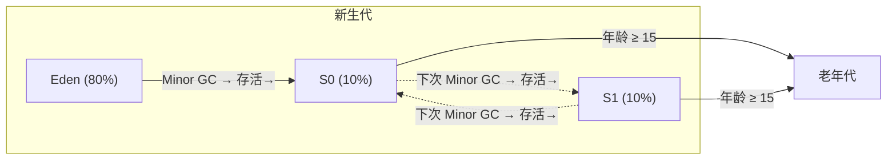
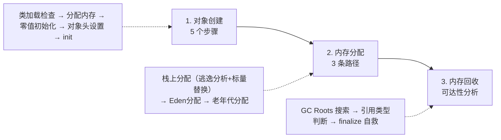

一个 `new Object()` 在 JVM 内部到底经历了什么？对象的内存怎么分配、何时回收？这些看似基础的问题，恰恰是理解 JVM 运作机制的关键入口。本文从对象创建、内存分配到垃圾回收，逐层剖析每一个细节。

---

## 一、对象的创建

当虚拟机遇到一条 `new` 指令，背后会经历一个完整的流程。


### 步骤 1：类加载检查

虚拟机首先检查这条指令的参数能否在常量池中定位到一个**类的符号引用**，并且检查该符号引用代表的类是否已被加载、解析和初始化过。如果没有，必须先执行相应的**类加载过程**。

`new` 指令的触发场景包括：`new` 关键字、对象克隆、对象序列化等。

### 步骤 2：分配内存

类加载检查通过后，虚拟机为新生对象分配内存。对象所需内存大小在类加载完成后便可完全确定——分配空间本质上就是**把一块确定大小的内存从 Java 堆中划分出来**。

这个步骤面临两个核心问题：

#### 问题一：如何划分内存？

| 方式 | 适用场景 | 原理 |
|------|----------|------|
| **指针碰撞**（Bump the Pointer） | 堆内存规整（默认） | 用一个指针作为分界点，分配时指针向空闲方向移动对象大小的距离 |
| **空闲列表**（Free List） | 堆内存不规整 | 维护可用内存块列表，从中找一块足够大的划分给对象，并更新列表 |

#### 问题二：并发分配如何保证线程安全？

- **CAS + 失败重试**：虚拟机采用 CAS 配上失败重试的方式，保证内存分配操作的原子性。
- **TLAB（Thread Local Allocation Buffer）**：每个线程在 Java 堆中预先分配一小块私有内存，分配时优先在 TLAB 中进行，只有 TLAB 用完才需要同步。通过 `-XX:+UseTLAB` 控制（JVM 默认开启），`-XX:TLABSize` 指定大小。

### 步骤 3：初始化零值

内存分配完成后，虚拟机将分配到的内存空间（不包括对象头）**全部初始化为零值**。如果使用了 TLAB，这一步可以提前至 TLAB 分配时进行。

这一步保证了对象的实例字段在不赋初始值的情况下也能直接使用——程序访问到的是数据类型对应的零值（`int` 为 0，`boolean` 为 false，引用类型为 null）。

### 步骤 4：设置对象头

在 HotSpot 虚拟机中，对象在内存中的存储布局分为 3 块区域：

| 区域 | 说明 |
|------|------|
| **对象头（Header）** | MarkWord + 类型指针（Klass Pointer） |
| **实例数据（Instance Data）** | 对象的实际字段数据 |
| **对齐填充（Padding）** | 保证对象大小是 8 字节的整数倍 |

**MarkWord** 存储对象自身的运行时数据：HashCode、GC 分代年龄、锁状态标志、线程持有的锁、偏向线程 ID、偏向时间戳等。

**Klass Pointer** 是对象指向它的类元数据的指针，虚拟机通过这个指针确定对象是哪个类的实例。


HotSpot 源码中 MarkWord 的位布局（32 位）：

```
hash:25 ──────────>| age:4  biased_lock:1  lock:2  (normal object)
JavaThread*:23 epoch:2 age:4 biased_lock:1 lock:2  (biased object)
```

64 位下：

```
unused:25 hash:31 ──>| unused:1 age:4 biased_lock:1 lock:2  (normal object)
JavaThread*:54 epoch:2 unused:1 age:4 biased_lock:1 lock:2 (biased object)
```

### 步骤 5：执行 `<init>` 方法

最后执行 `<init>` 方法，即按照程序员的意愿进行初始化——为属性赋程序员指定的值，并执行构造方法。

> 注意：这与步骤 3 的"赋零值"不同，这里是程序员自定义的赋值。

---

## 二、对象大小与指针压缩

### 2.1 使用 JOL 查看对象布局

推荐使用 **JOL（Java Object Layout）** 工具包来精确查看对象的内存占用：

```xml
<dependency>
    <groupId>org.openjdk.jol</groupId>
    <artifactId>jol-core</artifactId>
    <version>0.9</version>
</dependency>
```

```java
import org.openjdk.jol.info.ClassLayout;

public class JOLSample {

    public static void main(String[] args) {
        // 查看普通 Object 的大小
        ClassLayout layout = ClassLayout.parseInstance(new Object());
        System.out.println(layout.toPrintable());

        System.out.println();

        // 查看空数组的大小
        ClassLayout layout1 = ClassLayout.parseInstance(new int[]{});
        System.out.println(layout1.toPrintable());

        System.out.println();

        // 查看自定义对象的大小
        ClassLayout layout2 = ClassLayout.parseInstance(new A());
        System.out.println(layout2.toPrintable());
    }

    // -XX:+UseCompressedOops           默认开启，压缩所有指针
    // -XX:+UseCompressedClassPointers  默认开启，压缩对象头里的 Klass Pointer
    // Oops : Ordinary Object Pointers
    public static class A {
        // 8B  mark word
        // 4B  Klass Pointer（关闭压缩则 8B）
        int id;        // 4B
        String name;   // 4B（关闭压缩则 8B）
        byte b;        // 1B
        Object o;      // 4B（关闭压缩则 8B）
    }
}
```

**运行结果**（64 位 + 指针压缩开启）：

```
java.lang.Object object internals:
 OFFSET  SIZE   TYPE   DESCRIPTION                    VALUE
      0     4          (object header)                01 00 00 00  // MarkWord 前半
      4     4          (object header)                00 00 00 00  // MarkWord 后半
      8     4          (object header)                e5 01 00 f8  // Klass Pointer
     12     4          (loss due to alignment)
Instance size: 16 bytes                        ← Object 占用 16 字节

[A 对象]
 OFFSET  SIZE   TYPE   DESCRIPTION                    VALUE
      0     4          (object header)                01 00 00 00
      4     4          (object header)                00 00 00 00
      8     4          (object header)                61 cc 00 f8
     12     4    int   A.id                           0
     16     1    byte  A.b                            0
     17     3          (alignment/padding gap)
     20     4    String A.name                        null
     24     4    Object A.o                           null
     28     4          (loss due to alignment)
Instance size: 32 bytes
Space losses: 3 bytes internal + 4 bytes external = 7 bytes total
```

可以清楚看到：MarkWord 占 8 字节，Klass Pointer 占 4 字节（压缩后），int 占 4 字节，byte 占 1 字节但对齐后浪费了 3 字节。

### 2.2 指针压缩详解

**为什么需要指针压缩？**

在 64 位平台上使用 32 位指针，内存使用会多出约 1.5 倍。更大的指针意味着：
- 主内存和缓存之间移动数据的**带宽占用更大**
- GC 承受的**压力更大**

**压缩原理**：

- JDK 1.6 update14 开始，64 位 JVM 支持指针压缩
- 配置参数：`-XX:+UseCompressedOops`（默认开启）
- 32 位地址最大支持 4G 内存（2³²），通过压缩编码/解码优化，使得 32 位地址支持到 **32G** 以内
- 堆内存 **< 4G** 时，直接去除高 32 位地址，无需压缩
- 堆内存 **> 32G** 时，压缩指针**失效**，强制使用 64 位寻址 → 内存膨胀、GC 压力增大

> **实战建议**：堆内存尽量不要超过 32G，保持在指针压缩有效范围内。

---

## 三、对象内存分配

### 3.1 内存分配流程图

对象到底分配在哪里？并不全是堆上，JVM 有一条完整的决策链：


### 3.2 栈上分配与逃逸分析

JVM 通过**逃逸分析**来确定对象是否可以被外部访问。如果一个对象不会逃逸出方法，就可以在**栈上分配内存**——随栈帧出栈而销毁，完全不用 GC 参与，极大地减轻垃圾回收压力。

**逃逸分析**：分析对象的动态作用域。当一个对象在方法中被定义后，如果被外部方法引用（如作为返回值或参数传出），就发生了逃逸。

```java
// 发生逃逸——user 对象被返回，作用域不确定
public User test1() {
    User user = new User();
    user.setId(1);
    user.setName("zhuge");
    return user;
}

// 未逃逸——user 对象在方法结束后即为无效，可栈上分配
public void test2() {
    User user = new User();
    user.setId(1);
    user.setName("zhuge");
}
```

**标量替换**：当逃逸分析确定对象不会外部访问且可被进一步分解时，JVM 不创建该对象，而是将成员变量分解为若干个标量替代，直接在栈帧或寄存器上分配。

| 概念 | 说明 |
|------|------|
| **标量** | 不可再分解的量，如 int、long 等基本类型和 reference 类型 |
| **聚合量** | 可进一步分解的量，如 Java 中的对象 |

**参数配置**：

| 参数 | 说明 | 默认值 |
|------|------|--------|
| `-XX:+DoEscapeAnalysis` | 开启逃逸分析 | JDK7+ 默认开启 |
| `-XX:+EliminateAllocations` | 开启标量替换 | JDK7+ 默认开启 |

**验证示例**——1 亿次对象分配，堆仅 15M，不发生 GC：

```java
/**
 * 栈上分配 + 标量替换 验证
 * -Xmx15m -Xms15m -XX:+DoEscapeAnalysis -XX:+PrintGC -XX:+EliminateAllocations
 */
public class AllotOnStack {

    public static void main(String[] args) {
        long start = System.currentTimeMillis();
        for (int i = 0; i < 100000000; i++) {
            alloc();
        }
        long end = System.currentTimeMillis();
        System.out.println(end - start);
    }

    private static void alloc() {
        User user = new User();
        user.setId(1);
        user.setName("zhuge");
    }
}
```

**结论**：
- 同时开启逃逸分析和标量替换 → **不发生 GC**（栈上分配生效）
- 关闭任意一个 → **大量 GC 发生**（1 亿对象全部分配在堆上）

### 3.3 对象在 Eden 区分配

大多数情况下，对象在新生代的 **Eden 区**分配。先区分两种 GC：

| GC 类型 | 作用范围 | 特点 |
|---------|---------|------|
| **Minor GC / Young GC** | 仅新生代 | 非常频繁，回收速度快 |
| **Major GC / Full GC** | 老年代 + 新生代 + 方法区 | 速度比 Minor GC 慢 **10 倍以上** |

**Eden 与 Survivor 默认比例 8:1:1**：



> 注意：JVM 默认开启 `-XX:+UseAdaptiveSizePolicy`，会导致 8:1:1 比例自动调整。如果不希望变化，可以设置 `-XX:-UseAdaptiveSizePolicy`。

**实验：Eden 区分配验证**

```java
// JVM参数：-XX:+PrintGCDetails
public class GCTest {
    public static void main(String[] args) {
        byte[] allocation1, allocation2;

        allocation1 = new byte[60000 * 1024];  // 约 60M

        // 此时再分配 8M，Eden 不够 → 触发 Minor GC
        // allocation1(60M) 太大无法放入 Survivor → 直接进老年代
        allocation2 = new byte[8000 * 1024];
    }
}
```

**GC 日志解读**：

```
[GC (Allocation Failure) [PSYoungGen: 65253K->936K(76288K)]
        65253K->60944K(251392K), 0.0279083 secs]

PSYoungGen   total 76288K, used 9591K
  eden  space 65536K, 13% used
  from  space 10752K, 8% used
  to    space 10752K, 0% used
ParOldGen    total 175104K, used 60008K
  object space 175104K, 34% used
```

关键信息：
- Eden 区 100% → Minor GC 后变为 13%
- `allocation1`（60M）因为太大无法放入 Survivor（仅 10M），被**直接晋升到老年代**
- 老年代 used 从 0 变为 60008K（正好约 60M），验证了晋升行为
- allocation2（8M）GC 后正常分配到 Eden 区

### 3.4 大对象直接进入老年代

**大对象**：需要大量连续内存空间的对象（如大字符串、大数组）。

参数 `-XX:PretenureSizeThreshold` 可设置大对象阈值，超过该大小的对象直接进老年代（仅 Serial 和 ParNew 收集器生效）：

```
-XX:PretenureSizeThreshold=1000000 -XX:+UseSerialGC
```

**Why？** 避免为大对象在 Eden 和 Survivor 之间复制时产生的性能损耗。

### 3.5 长期存活对象晋升老年代

对象在 Eden 出生 → 第一次 Minor GC 存活 → 移至 Survivor → **年龄设为 1**。每熬过一次 Minor GC，年龄 +1。默认年龄达到 **15**（可通过 `-XX:MaxTenureThreshold` 设置）后晋升老年代。

> CMS 收集器默认年龄为 6。

### 3.6 动态年龄判断

除了固定阈值，还有一种动态晋升规则：

> 当前 Survivor 区域中，**相同年龄的所有对象大小总和**超过 Survivor 区域大小的 **50%**（`-XX:TargetSurvivorRatio` 可调），那么**大于等于该年龄的对象**直接进入老年代。

**目的**：让可能长期存活的对象尽早进入老年代，减少在 Survivor 区的无谓复制。动态年龄判断一般在 Minor GC 后触发。

### 3.7 老年代空间分配担保机制

每次 Minor GC 之前，JVM 都会检查老年代剩余可用空间：

1. 如果老年代可用空间 **<** 新生代所有对象大小之和 → 检查 `-XX:HandlePromotionFailure`（JDK8 默认开启）
2. 比较老年代可用内存 vs **历次 Minor GC 后晋升对象的平均大小**
3. 如果可用内存更小 → 触发 **Full GC**（同时回收老年代和新生代）
4. Full GC 后仍不够 → **OOM**

Minor GC 后，如果存活对象大小 > 老年代可用空间，也会触发 Full GC；Full GC 后仍不够 → OOM。

---

## 四、对象内存回收

### 4.1 引用计数法

给对象添加一个引用计数器，每有一个地方引用 +1，引用失效 -1，计数器为 0 时回收。

```java
public class ReferenceCountingGc {
    Object instance = null;

    public static void main(String[] args) {
        ReferenceCountingGc objA = new ReferenceCountingGc();
        ReferenceCountingGc objB = new ReferenceCountingGc();
        objA.instance = objB;
        objB.instance = objA;  // 循环引用
        objA = null;
        objB = null;
        // objA 和 objB 互相引用，计数器都不为 0 → 无法回收！
    }
}
```

**缺点**：无法解决循环引用问题。因此主流 JVM **不采用**此算法。

### 4.2 可达性分析算法（GC Roots）

以 **GC Roots** 对象为起点，向下搜索所有被引用的对象链——链上的对象为**存活**，其余为**垃圾**。


**GC Roots 包括**：线程栈的本地变量、静态变量、本地方法栈的变量、JNI 引用等。

### 4.3 常见引用类型

Java 四种引用类型，按强度递减：


| 引用类型 | 代码示例 | 回收时机 | 应用场景 |
|----------|---------|----------|----------|
| **强引用** | `User u = new User()` | 永远不会被 GC 回收 | 普通对象引用 |
| **软引用** | `new SoftReference<User>(new User())` | 内存不足时才回收 | 内存敏感缓存（如浏览器后退页面缓存） |
| **弱引用** | `new WeakReference<User>(new User())` | GC 时直接回收 | WeakHashMap 等 |
| **虚引用** | `new PhantomReference<>()` | 随时可被回收 | 对象回收跟踪（几乎不用） |

### 4.4 finalize() —— 最后的自救

可达性分析中不可达的对象并非立即死亡，至少经历两次标记：

1. **第一次标记 + 筛选**：检查对象是否覆盖 `finalize()` 方法。没有覆盖 → 直接回收。
2. **第二次标记**：如果覆盖了 `finalize()`，对象可在 `finalize()` 中重新与 GC Roots 关联。关联成功 → 移除出"即将回收"集合；失败 → 真正回收。

> **注意**：`finalize()` 只会被调用一次，自救机会也只有一次。不推荐在生产代码中依赖 `finalize()`。

### 4.5 如何判断一个类是无用的类

方法区主要回收**无用的类**，需同时满足三个条件：

1. 该类所有的**实例**都已被回收（Java 堆中不存在该类的任何实例）
2. 加载该类的 **ClassLoader** 已被回收
3. 该类对应的 `java.lang.Class` 对象没有任何地方被引用（无法通过反射访问）

---

## 五、总结

本文从一条 `new` 指令出发，串联了对象完整生命周期的三大环节：



**核心记忆点**：

| 维度 | 关键内容 |
|------|---------|
| 创建流程 | 5 步：类加载检查 → 分配（指针碰撞/空闲列表 + CAS/TLAB）→ 零值 → 对象头 → init |
| 内存分配 | 优先栈上 → Eden → 大对象/长期存活/动态年龄/担保失败 → 老年代 |
| 指针压缩 | 堆 < 32G 生效，> 32G 失效导致内存膨胀 |
| 垃圾判定 | GC Roots 可达性分析（非引用计数），四种引用类型强度递减 |
| 自救机制 | `finalize()` 仅一次机会（不推荐使用） |

理解对象的完整生命周期，是进行 JVM 调优和内存问题排查的必备基础。

---

> **参考来源**：本文内容整理自楼兰老师的 JVM 课程笔记。
