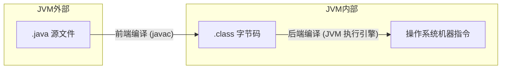

从计算机程序出现的第一天起，对执行效率的追求就是程序员天生的信仰——就像一场没有终点的赛车。程序员是车手，技术平台是赛车。今天我们就来看看，JVM 这辆赛车是如何通过执行引擎来提升性能的。

---

## 一、前端编译与后端编译

Java 程序的编译过程分为两个部分：



| 编译阶段 | 位置 | 输入 → 输出 | 与 JVM 的关系 |
|---------|------|------------|--------------|
| **前端编译** | JVM 之外 | `.java` → `.class` | 与 JVM 无关，任何语言只要产出合规的 class 文件即可 |
| **后端编译** | JVM 内部 | `.class` 字节码 → 本地机器指令 | 执行引擎的核心职责 |

前端编译不在本文讨论范围——我们聚焦 JVM 如何在**后端编译**过程中提升执行效率。

---

## 二、字节码指令是如何执行的

### 2.1 解释执行 vs 编译执行

Class 文件中已经保留了每行 Java 代码对应的字节码指令。执行引擎的任务就是**将这些字节码指令翻译成操作系统的机器码**，本质上就是一个"翻译官"。


| 执行方式 | 原理 | 优点 | 缺点 |
|---------|------|------|------|
| **解释执行** | 来一条指令翻译一次（逐条翻译） | 启动快，内存省 | 执行效率低（多一层中间转换） |
| **编译执行** | 提前将字节码编译为本地机器码，缓存到 **CodeCache**，执行时直接取 | 执行效率高 | 启动慢，预热久，占内存 |

早期的 JVM 采用纯解释执行，这也是长久以来 Java 被 C/C++ 开发者吐槽"慢"的根源。

**JIT（Just In Time Compiler）即时编译器**：Java 不可能提前编译所有代码（谁知道程序员会写什么），所以退而求其次——**只编译运行频率最高的热点代码**，放入 CodeCache 缓存。

使用 `java -version` 即可看到当前执行模式：


### 2.2 为什么默认用混合模式？

HotSpot 默认采用**混合执行**（Mixed Mode），而非纯编译执行。原因有二：

1. **内存限制**：编译执行将越来越多的代码编译为本地代码会增加内存压力。客户端应用、嵌入式系统等资源紧张场景，解释执行更省内存。

2. **预热成本**：在 CodeCache 建立好之前，编译执行需要额外消耗来识别热点代码、维护缓存——这个过程还需要解释执行提供信息支持。

**混合模式 = 解释执行打头阵 + 热点代码编译优化**，兼顾启动速度与峰值性能。

---

## 三、热点代码识别

JIT 编译的前提是识别热点代码，这个过程叫**热点探测（Hot Spot Code Detection）**——这也是 HotSpot 虚拟机名字的由来。

HotSpot 采用**基于计数器的热点探测**：为每个方法准备两类计数器。

### 3.1 方法调用计数器（Invocation Counter）

统计方法被调用的次数。默认阈值 **10000 次**（`-XX:CompileThreshold` 可调）。


流程：
1. 方法被调用 → 检查是否有 JIT 编译版本 → 有则直接用
2. 没有 → 计数器 +1 → 判断（方法调用计数器 + 回边计数器）之和是否超过阈值
3. 超过 → 向 JIT 提交编译请求

### 3.2 回边计数器（Back Edge Counter）

统计方法内部**循环体代码的执行次数**。字节码中遇到控制流向后跳转的指令就是"回边"。

回边计数器在 Server 模式下的默认阈值计算公式：

```
回边计数器阈值 = CompileThreshold × (OnStackReplacePercentage - InterpreterProfilePercentage) / 100
               = 10000 × (140 - 33) / 100
               = 10700
```

| 参数 | 默认值 | 说明 |
|------|--------|------|
| `OnStackReplacePercentage` | 140 | OSR 比率 |
| `InterpreterProfilePercentage` | 33 | 解释器监控比率 |


当超过阈值时，提交 OSR（On Stack Replacement）编译请求，并把回边计数器略微降低，在解释器中继续执行循环、等待编译结果。

> 两类计数器互补：方法调用计数器看**跨方法调用**的热度，回边计数器看**方法内部循环**的热度。

---

## 四、客户端编译器与服务端编译器（C1 / C2）


HotSpot 内置两个即时编译器：

| 编译器 | 定位 | 优化策略 | 编译速度 | 执行效率 | 适用场景 |
|--------|------|---------|---------|---------|---------|
| **C1（Client Compiler）** | 初级翻译 | 简单可靠的优化 | 快 | 一般 | 桌面应用（启动快、省内存） |
| **C2（Server Compiler）** | 高级翻译 | 耗时长、更激进的优化 | 慢 | 高 | 服务端应用（资源充裕、追求峰值性能） |

**C1 和 C2 不是互相取代，而是相互协作的。** C2 编译前往往需要 C1 收集性能监控数据；C2 的最终效果也需要与 C1 对比来确定——某些情况下 C2 反而不如 C1，此时需退回到 C1 重新编译。

### 4.1 分层编译

为了在启动速度与运行效率之间取得最佳平衡，HotSpot 引入分层编译：

| 层级 | 编译器 | 描述 | 性能评分 |
|------|--------|------|----------|
| **0** | 解释器 | 纯解释执行，不开启性能监控 | 1 |
| **1** | C1 | 简单可靠的优化，不开启性能监控 | 4 |
| **2** | C1 | 仅开启方法调用和回边次数统计 | 3 |
| **3** | C1 | 开启全部性能监控（分支跳转、虚方法调用版本等） | 2 |
| **4** | C2 | 启用更多耗时优化的激进编译 | 5 |

越高的层级优化越激进，但编译耗时也越长。

**验证示例**——不同编译模式下的性能对比：

```java
public class JitDemo {
    private int add(int x) {
        return x + 1;
    }

    public static void main(String[] args) {
        JitDemo demo = new JitDemo();
        int a = 0;
        long l = System.currentTimeMillis();
        for (int i = 0; i < 10000000; i++) {
            a = demo.add(a);
        }
        System.out.println("a= " + a);
        System.out.println(">>>>>>>>" + (System.currentTimeMillis() - l));
    }
}
```

可分别使用以下参数对比：
- `-Xint`：纯解释执行
- `-Xcomp`：纯编译执行
- `-XX:TieredStopAtLevel=1`：仅 C1 编译
- `-XX:TieredStopAtLevel=5`：开启 C2（默认）

---

## 五、后端编译优化技术

JIT 在编译热点代码时，会运用一系列优化技术来提升运行效率。

### 5.1 方法内联（Inline）

**核心思想**：把目标方法的代码"复制"到发起调用的方法中，避免真实的方法调用——减少频繁创建栈帧的性能开销。


```java
public class CompDemo {
    // 内联前
    private int add1(int x1, int x2, int x3, int x4) {
        return add2(x1, x2) + add2(x3, x4);
    }
    private int add2(int x1, int x2) {
        return x1 + x2;
    }
    
    // 内联优化后 → 等价于
    private int add(int x1, int x2, int x3, int x4) {
        return x1 + x2 + x3 + x4;
    }
}
```

添加参数可观察内联决策：

```
-XX:+PrintCompilation -XX:+UnlockDiagnosticVMOptions -XX:+PrintInlining
```


> 需要循环超过阈值（10000 次）触发 JIT 后才会发生内联。

**方法内联是后续很多优化手段的基础**。比如内联后可以进一步做死代码消除：

```java
public class InlineDemo {
    public static void foo(Object obj) {
        if (obj != null) {
            System.out.println("do something");
        }
    }
    
    // 内联后 → JIT 发现 obj 恒为 null → 死代码 → 整个 foo 调用被消除
    public static void testInline() {
        Object obj = null;
        foo(obj);
    }
}
```

**内联相关参数**：

| 参数 | 默认值 | 说明 |
|------|--------|------|
| `-XX:+Inline` | 开启 | 启用方法内联 |
| `-XX:InlineSmallCode` | 1000 bytes | 超过此值的方法无法内联 |
| `-XX:MaxInlineSize` | 35 bytes | 普通方法内联的最大字节数 |
| `-XX:FreqInlineSize` | 325 bytes | 热点方法内联的最大字节数 |
| `-XX:MaxTrivialSize` | 6 bytes | 琐碎方法（如 `return 42`）的最大字节数 |
| `-XX:+PrintInlining` | 关闭 | 打印内联决策（需配合 `-XX:+UnlockDiagnosticVMOptions`） |

**提高内联概率的实践建议**：
1. 尽量写**小方法**，避免大方法——方法太大会导致无法内联，且成为热点后会占用更多 CodeCache
2. 内存充裕时可调整参数，降低热点阈值或增大方法体阈值
3. 尽量使用 `final`、`private`、`static` 修饰方法——需要继承的方法（`invokevirtual` 调用）在编译时很难确定具体版本

### 5.2 逃逸分析（Escape Analysis）

分析对象动态作用域：一个对象在方法中定义后，是否被外部引用？


| 逃逸程度 | 定义 | 示例 |
|----------|------|------|
| **不逃逸** | 对象仅在方法内部使用 | 局部变量，不返回、不传出 |
| **方法逃逸** | 对象被外部方法引用 | 作为参数传递到其他方法 |
| **线程逃逸** | 对象被其他线程访问 | 赋值给实例变量，其他线程可见 |

JDK8 默认开启逃逸分析，`-XX:-DoEscapeAnalysis` 可关闭。

### 5.3 标量替换（Scalar Replacement）

| 概念 | 说明 |
|------|------|
| **标量** | 不可再分解的数据，如 int、long、reference 类型 |
| **聚合量** | 可分解的数据，如 Java 对象 |

如果逃逸分析证明对象不会逃逸到方法外且可拆散，JIT 不会创建对象——而是把成员变量拆分为标量，直接在栈帧或寄存器上分配。

JDK8 默认开启标量替换（`-XX:-EliminateAllocations` 可关闭）。

### 5.4 栈上分配（Stack Allocations）

如果确定对象不会逃逸出线程，就在**栈上分配内存**——对象随栈帧出栈自动销毁，GC 完全不用参与。


**三者的依赖关系**：


关键理解：
- **逃逸分析是基础**：线程逃逸的对象在堆中可能被多个线程引用，无法移到栈上
- **标量替换是手段**：栈空间有限，必须把对象瘦身为最精简的标量
- **栈上分配是目的**：让大量局部对象随方法结束自动销毁，大幅减轻 GC 压力

**验证示例**：

```java
public class EscapeAnalysisTest {
    public static void main(String[] args) throws InterruptedException {
        long start = System.currentTimeMillis();
        for (int i = 0; i < 10000000; i++) {
            allocate();
        }
        System.out.println("运行耗时：" + (System.currentTimeMillis() - start));
        Thread.sleep(6000000);
    }

    static void allocate() {
        MyObject myObject = new MyObject(2024, 2024.6);
    }

    static class MyObject {
        int a;
        double b;
        MyObject(int a, double b) {
            this.a = a;
            this.b = b;
        }
    }
}
```

| 条件 | 耗时 | 说明 |
|------|------|------|
| 默认（逃逸分析 + 标量替换开启） | ~2ms | 对象栈上分配，几乎无 GC |
| 关闭逃逸分析或标量替换 | ~44ms | 1000 万对象全部堆分配 → 大量 GC |

### 5.5 锁消除（Lock Elision）

当 JVM 检测到一个锁不存在多线程竞争时，会直接将这个锁消除。

**最简单的场景**：如果一个方法没有发生逃逸，其内部的锁都不存在竞争。

```java
public class LockElisionDemo {
    // StringBuffer 的 append/toString 都是 synchronized 的
    public static String BufferString(String s1, String s2) {
        StringBuffer sb = new StringBuffer();  // 局部变量，不会逃逸
        sb.append(s1);
        sb.append(s2);
        return sb.toString();
    }

    public static String BuilderString(String s1, String s2) {
        StringBuilder sb = new StringBuilder();
        sb.append(s1);
        sb.append(s2);
        return sb.toString();
    }

    public static void main(String[] args) {
        // 触发 JIT 后，BufferString 中的 synchronized 被消除
        // 二者耗时接近
    }
}
```

**实验结果**：

| 条件 | StringBuffer | StringBuilder |
|------|-------------|---------------|
| **锁消除开启**（默认） | ~1521ms | ~1039ms |
| **锁消除关闭** (`-XX:-EliminateLocks`) | ~2461ms | ~1049ms |

开启锁消除后，StringBuffer 与 StringBuilder 差距大幅缩小；关闭后差距翻倍。

---

## 六、总结

JVM 执行引擎是一个精心设计的"赛车引擎"，核心思路可以归纳为一条主线：


**核心要点速查**：

| 维度 | 关键内容 |
|------|---------|
| **执行模式** | 混合模式 = 解释执行（快速启动）+ JIT 编译（峰值性能） |
| **热点探测** | 方法调用计数器（10000） + 回边计数器（10700），溢出即触发 JIT |
| **编译器** | C1 快速简单 → C2 激进优化，分层编译逐级递进（0→1→2→3→4） |
| **方法内联** | 复制方法体到调用点，减少栈帧开销；小方法 + final/private 更易内联 |
| **逃逸分析** | 分析对象作用域，不逃逸 → 栈上分配 → GC 压力骤降 |
| **锁消除** | 局部对象无竞争 → synchronized 直接消除 |
| **标量替换** | 对象拆散为基本类型，栈上/寄存器分配 |

> 理解执行引擎的优化机制，不是为了背诵参数，而是为了在写代码时有意识地配合 JVM——小方法、局部变量、减少不必要的同步——让 JIT 有更大的优化空间。

---

> **参考来源**：本文内容整理自楼兰老师的 JVM 课程笔记。
