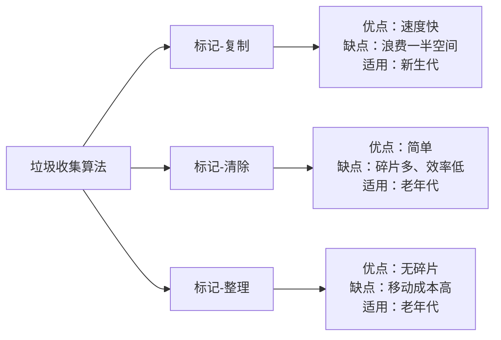
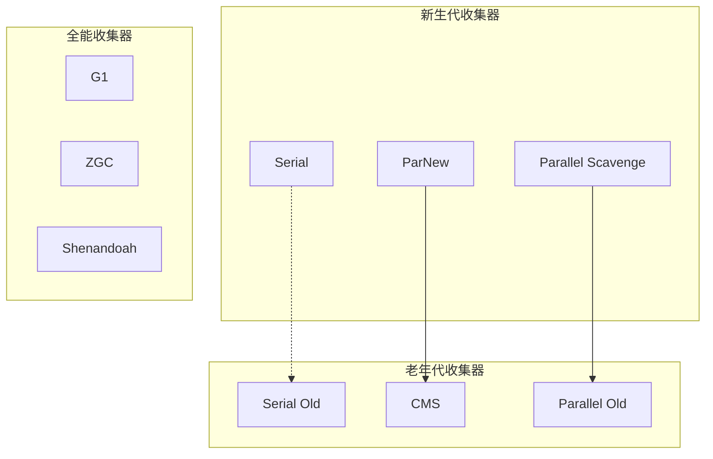
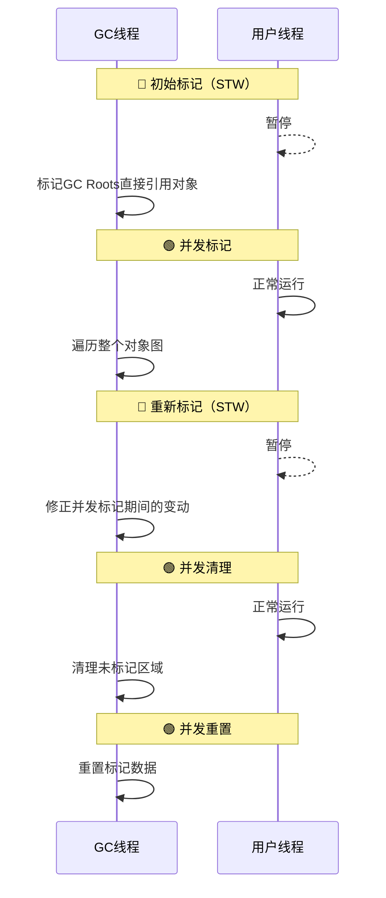
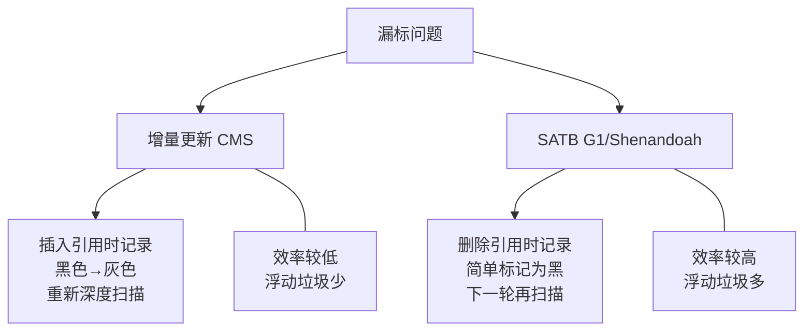
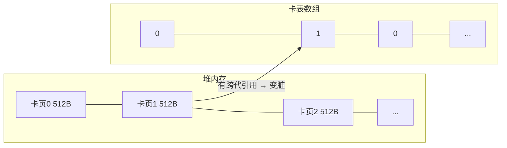
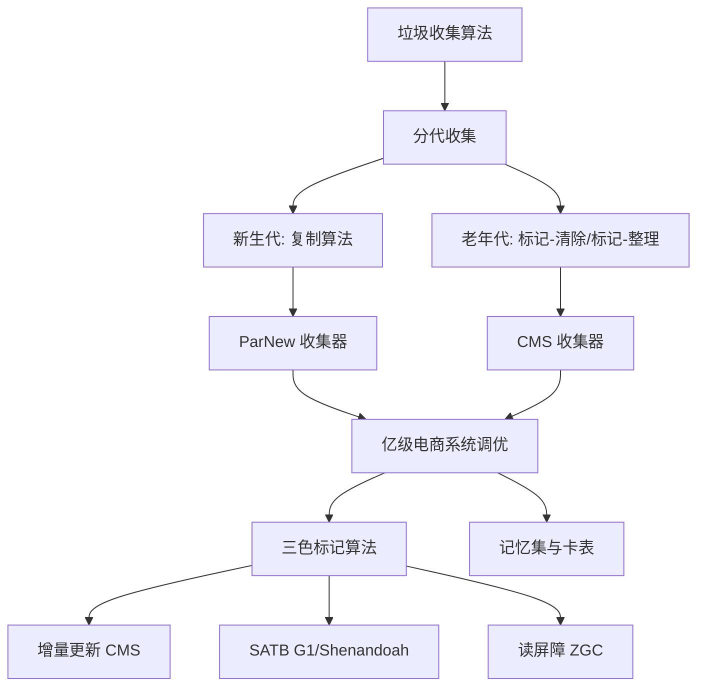

> 本文深入剖析垃圾收集算法演进，详解 ParNew + CMS 收集器原理与实战调优，并揭开底层三色标记算法、读写屏障与记忆集的技术细节。

## 一、垃圾收集算法

### 1.1 分代收集理论

当前虚拟机的垃圾收集都采用**分代收集算法**，根据对象存活周期的不同将内存分为几块。一般将 Java 堆分为**新生代**和**老年代**，根据各个年代的特点选择合适的垃圾收集算法。


- **新生代**：每次收集都会有大量对象（近99%）死去，可以选择**复制算法**，只需付出少量对象的复制成本即可完成每次垃圾收集。
- **老年代**：对象存活几率较高，且没有额外的空间进行分配担保，必须选择**"标记-清除"**或**"标记-整理"**算法。

> **注意**："标记-清除"或"标记-整理"算法会比复制算法慢 **10 倍以上**。

### 1.2 标记-复制算法

为了解决效率问题，"复制"收集算法将内存分为大小相同的两块，每次使用其中的一块。当这一块的内存使用完后，就将还存活的对象复制到另一块去，然后再把使用的空间一次清理掉。


### 1.3 标记-清除算法

算法分为"标记"和"清除"阶段：标记存活的对象，统一回收所有未被标记的对象（一般选择这种）。它是最基础的收集算法，比较简单，但是有两个明显的问题：

1. **效率问题**：如果需要标记的对象太多，效率不高
2. **空间问题**：标记清除后会产生大量不连续的碎片


### 1.4 标记-整理算法

根据老年代的特点特出的一种标记算法，标记过程与"标记-清除"算法一样，但后续步骤不是直接对可回收对象回收，而是让所有存活的对象向一端移动，然后直接清理掉端边界以外的内存。


**三种回收算法对比如下**：



---

## 二、垃圾收集器全景

> 如果说收集算法是内存回收的**方法论**，那么垃圾收集器就是内存回收的**具体实现**。

虽然没有万能的垃圾收集器，但我们可以根据具体应用场景选择最合适的。以下是主流收集器的分类与特性：




### 2.1 Serial 收集器

`-XX:+UseSerialGC -XX:+UseSerialOldGC`

Serial（串行）收集器是最基本、历史最悠久的垃圾收集器。它的"单线程"意义不仅仅意味着它只会使用一条垃圾收集线程，更重要的是它在进行垃圾收集工作的时候必须暂停其他所有的工作线程（**"Stop The World"**），直到它收集结束。

- 新生代采用**复制算法**，老年代采用**标记-整理算法**
- 简单而高效，没有线程交互的开销，单线程收集效率高
- Serial Old 收集器主要用于：JDK1.5 以前与 Parallel Scavenge 搭配，或作为 CMS 收集器的后备方案

### 2.2 Parallel Scavenge 收集器

`-XX:+UseParallelGC`（年轻代）`-XX:+UseParallelOldGC`（老年代）

Parallel 收集器其实就是 Serial 收集器的**多线程版本**，默认收集线程数跟 CPU 核数相同（可用 `-XX:ParallelGCThreads` 指定，一般不建议修改）。

**关注点是吞吐量**（高效率利用 CPU），与 CMS 的关注点（用户线程停顿时间）不同：

> 吞吐量 = 运行用户代码时间 / CPU 总消耗时间

- 新生代采用复制算法，老年代采用标记-整理算法
- JDK8 **默认**的新生代和老年代收集器
- 在注重吞吐量及 CPU 资源的场合优先考虑

### 2.3 ParNew 收集器

`-XX:+UseParNewGC`

ParNew 收集器跟 Parallel 收集器很类似，区别主要在于它可以和 **CMS 收集器配合使用**。

- 新生代采用复制算法
- 许多运行在 Server 模式下的虚拟机的首要选择
- 除了 Serial 收集器外，**只有它能与 CMS 收集器配合工作**

### 2.4 CMS 收集器

`-XX:+UseConcMarkSweepGC`（老年代）

**CMS（Concurrent Mark Sweep）**收集器是一种以获取**最短回收停顿时间**为目标的收集器。它是 HotSpot 虚拟机第一款真正意义上的**并发收集器**，第一次实现了让垃圾收集线程与用户线程（基本上）同时工作。

从 `Mark Sweep` 这个名字可以看出，CMS 收集器是一种 **"标记-清除"算法**实现的。


#### CMS 四个步骤



| 阶段 | 是否 STW | 说明 |
|------|----------|------|
| **初始标记** | 是 | 记录 GC Roots 直接引用的对象，速度很快 |
| **并发标记** | 否 | 从 GC Roots 遍历整个对象图，耗时长但不需停顿 |
| **重新标记** | 是 | 修正并发标记期间引用变动的对象标记（主要处理漏标） |
| **并发清理** | 否 | 对未标记区域做清扫，新增对象标记为黑色不做处理 |
| **并发重置** | 否 | 重置本次 GC 过程中的标记数据 |


#### CMS 的优缺点

| 优点 | 缺点 |
|------|------|
| 并发收集、低停顿 | 对 CPU 资源敏感（会和服务抢资源） |
| 优秀用户体验 | 无法处理**浮动垃圾**（并发阶段新产生的垃圾） |
| 第一款真正并发收集器 | "标记-清除"导致大量空间碎片 |
| — | 存在 "concurrent mode failure" 风险 |

> **concurrent mode failure**：上一次垃圾回收还没执行完，垃圾回收又被触发。此时会进入 STW，用 Serial Old 垃圾收集器来回收。


#### CMS 核心参数速查

| 参数 | 说明 | 默认值 |
|------|------|--------|
| `-XX:+UseConcMarkSweepGC` | 启用 CMS | — |
| `-XX:ConcGCThreads` | 并发 GC 线程数 | — |
| `-XX:+UseCMSCompactAtFullCollection` | FullGC 之后做压缩整理 | — |
| `-XX:CMSFullGCsBeforeCompaction` | 多少次 FullGC 后压缩一次 | 0（每次） |
| `-XX:CMSInitiatingOccupancyFraction` | 老年代使用达到该比例触发 FullGC | 92（百分比） |
| `-XX:+UseCMSInitiatingOccupancyOnly` | 只使用设定的回收阈值 | 不指定则自动调整 |
| `-XX:+CMSScavengeBeforeRemark` | CMS GC 前启动一次 Minor GC | — |
| `-XX:+CMSParallelInitialMarkEnabled` | 初始标记多线程执行 | — |
| `-XX:+CMSParallelRemarkEnabled` | 重新标记多线程执行 | — |

---

## 三、实战：亿级流量电商系统 JVM 参数调优

以电商核心**订单系统**为例，机器内存 8G，分配 4G 内存给 JVM。

### 3.1 基础参数设置

```
-Xms3072M -Xmx3072M -Xss1M -XX:MetaspaceSize=256M -XX:MaxMetaspaceSize=256M -XX:SurvivorRatio=8
```

> 问题：可能会由于**动态对象年龄判断原则**导致频繁 Full GC。

### 3.2 优化新生代

```
-Xms3072M -Xmx3072M -Xmn2048M -Xss1M -XX:MetaspaceSize=256M -XX:MaxMetaspaceSize=256M -XX:SurvivorRatio=8
```


**核心思路**：让短期存活的对象尽量留在 Survivor 区，不要进入老年代，这样在 Minor GC 时这些对象就会被回收，不会导致 Full GC。


### 3.3 调整晋升阈值

对于一次 Minor GC 要间隔二三十秒的系统，大多数对象几秒内就会变为垃圾。可以将默认的 15 岁改小（如改为 5）：

- 对象经过 5 次 Minor GC 才进入老年代，整个时间约一两分钟
- 如果对象这么长时间都没被回收，可以认为这些对象会长久存活

大对象直接进入老年代参数设为 1M 即可（很少有超过 1M 的大对象）。

```
-Xms3072M -Xmx3072M -Xmn2048M -Xss1M -XX:MetaspaceSize=256M -XX:MaxMetaspaceSize=256M -XX:SurvivorRatio=8
-XX:MaxTenuringThreshold=5 -XX:PretenureSizeThreshold=1M
```

### 3.4 切换 ParNew + CMS

JDK8 默认垃圾回收器是 `ParallelGC` + `ParallelOldGC`。如果内存较大（超过 4G），系统对停顿时间敏感，可以使用 **ParNew + CMS**：

```
-XX:+UseParNewGC -XX:+UseConcMarkSweepGC
```

#### 老年代对象估算

可能长期存活进入老年代的对象：Spring Bean、线程池对象、初始化缓存数据等，充其量也就**几十 MB**。

但压测场景下，某次 Minor GC 后可能有超过一两百M存活对象直接进入老年代。估算**大概每隔五六分钟**出现一次这样的情况，大约**半小时到一小时**之间会因老年代满触发一次 Full GC。

> 此时已经过了抢购最高峰期，后续可能几小时才做一次 FullGC。

### 3.5 最终完整参数

```
-Xms3072M -Xmx3072M -Xmn2048M -Xss1M -XX:MetaspaceSize=256M -XX:MaxMetaspaceSize=256M -XX:SurvivorRatio=8
-XX:MaxTenuringThreshold=5 -XX:PretenureSizeThreshold=1M -XX:+UseParNewGC -XX:+UseConcMarkSweepGC
-XX:CMSInitiatingOccupancyFraction=92 -XX:+UseCMSCompactAtFullCollection -XX:CMSFullGCsBeforeCompaction=3
```

| 参数 | 值 | 原理 |
|------|-----|------|
| 年轻代 | 2048M | 对象存活时间短，预留充足空间 |
| 晋升年龄 | 5 次 | 减少长期占用 Survivor |
| 大对象阈值 | 1M | 超过直接进老年代 |
| CMS 触发 | 92% | 留 8% 缓冲浮动垃圾 |
| 碎片整理 | 每 3 次 FullGC | 减少碎片整理的 STW 频率 |

---

## 四、三色标记算法

在并发标记的过程中，因为标记期间应用线程还在继续跑，对象间的引用可能发生变化，**多标**和**漏标**的情况就有可能发生。漏标的问题主要引入了**三色标记算法**来解决。

### 4.1 三种颜色定义


| 颜色 | 含义 | 状态 |
|------|------|------|
| **黑色** | 对象被访问过，且所有引用都已扫描 | 安全存活，无需重新扫描 |
| **灰色** | 对象被访问过，但至少存在一个引用未扫描 | 正在处理中 |
| **白色** | 对象尚未被访问 | 分析结束仍是白色 → 不可达 |

> 黑色对象不可能直接（不经过灰色对象）指向某个白色对象。

### 4.2 多标 - 浮动垃圾

在并发标记过程中，由于方法运行结束导致部分局部变量（GC Root）被销毁，这个 GC Root 引用的对象之前又被扫描过（被标记为非垃圾），那么本轮 GC **不会回收**这部分内存——这就是**浮动垃圾**。

另外，针对并发标记开始后产生的**新对象**，通常直接当成**黑色**，本轮不进行清除。这部分对象可能也会变为垃圾，也属于浮动垃圾的一部分。

> 浮动垃圾不会影响正确性，只需要等到**下一轮垃圾回收**中才被清除。

### 4.3 漏标 - 两种解决方案

漏标会导致被引用的对象被当成垃圾**误删除**，这是严重 Bug，**必须解决**。有两种方案：


#### 方案一：增量更新（Incremental Update）— CMS 使用

当**黑色对象**插入新的指向**白色对象**的引用关系时，将这个新插入的引用记录下来。等并发扫描结束后，再以这些记录的黑色对象为根，重新扫描一次。

> 可以简化为：黑色对象一旦新插入了指向白色对象的引用，它就**变回灰色对象**了。

#### 方案二：原始快照（SATB）— G1、Shenandoah 使用

当**灰色对象**要删除指向**白色对象**的引用关系时，将这个要删除的引用记录下来。在并发扫描结束后，再以这些记录中的灰色对象为根，重新扫描一次，将白色对象直接标记为黑色。

> 目的是让这种对象在本轮 GC 中存活，待下一轮 GC 时重新扫描（可能是浮动垃圾）。



**为什么 G1 用 SATB，CMS 用增量更新？**

G1 的对象分布在不同的 Region，如果重新深度扫描代价比 CMS 高得多。所以 G1 选择 SATB，不深度扫描（只是简单标记黑，等下一轮 GC 再深度扫描），而 CMS 只有一块老年代区域，深度扫描开销可控。

---

## 五、读写屏障

### 5.1 写屏障

给某个对象的成员变量赋值时的底层代码：

```java
void oop_field_store(oop* field, oop new_value) {
    *field = new_value; // 赋值操作
}
```

所谓的**写屏障**，就是指在赋值操作前后，加入一些处理（类比 AOP 概念）：

```java
void oop_field_store(oop* field, oop new_value) {
    pre_write_barrier(field);         // 写屏障 - 写前操作
    *field = new_value;
    post_write_barrier(field, value); // 写屏障 - 写后操作
}
```

#### 写屏障实现 SATB（写前屏障）

当对象 B 的成员变量引用发生变化时（如 `a.b.d = null`），记录原来的引用对象：

```java
void pre_write_barrier(oop* field) {
    oop old_value = *field;    // 获取旧值
    remark_set.add(old_value); // 记录原来的引用对象
}
```

#### 写屏障实现增量更新（写后屏障）

当对象 A 的成员变量新增引用时（如 `a.d = d`），记录新的引用对象：

```java
void post_write_barrier(oop* field, oop new_value) {
    remark_set.add(new_value);  // 记录新引用的对象
}
```

### 5.2 读屏障 — ZGC 使用

```java
oop oop_field_load(oop* field) {
    pre_load_barrier(field); // 读屏障 - 读取前操作
    return *field;
}
```

读屏障直接针对读取时记录：

```java
void pre_load_barrier(oop* field) {
    oop old_value = *field;
    remark_set.add(old_value); // 记录读取到的对象
}
```

### 5.3 各收集器方案对比

| 收集器 | 漏标处理方案 |
|--------|-------------|
| **CMS** | 写屏障 + 增量更新 |
| **G1、Shenandoah** | 写屏障 + SATB |
| **ZGC** | 读屏障 |

---

## 六、记忆集与卡表

### 6.1 跨代引用问题

在新生代做 GC Roots 可达性扫描过程中可能会碰到跨代引用的对象，如果每次去老年代全量扫描效率太低。

为此引入**记录集（Remember Set）**数据结构，记录从非收集区到收集区的指针集合，避免把整个老年代加入 GC Roots 扫描范围。

> 所有涉及部分区域收集（Partial GC）行为的垃圾收集器（G1、ZGC、Shenandoah），都会面临同样的问题。

### 6.2 卡表（Card Table）

HotSpot 使用**卡表（Cardtable）**实现记忆集，是目前最常用的方式。卡表与记忆集的关系，可类比为 Java 中 HashMap 与 Map 的关系。

- 使用一个**字节数组**实现：`CARD_TABLE[]`
- 每个元素对应标识的内存区域一块特定大小的内存块，称为**"卡页"**
- HotSpot 使用的卡页大小是 **2^9 = 512 字节**




一个卡页中可包含多个对象，只要有一个对象的字段存在跨代指针，对应卡表元素标识就变成 **1**（变脏），否则为 **0**。

GC 时，只要筛选本收集区的卡表中变脏的元素加入 GC Roots 即可。

### 6.3 卡表维护 — 写屏障

卡表如何变脏？HotSpot 使用**写屏障**维护卡表状态。当发生引用字段赋值时，写屏障会自动更新卡表对应的标识为 1。

---

## 七、总结

本文从垃圾收集算法出发，逐步深入到 ParNew + CMS 收集器的原理与实战调优，最终揭开三色标记算法和读写屏障的底层实现。



| 维度 | 核心要点 |
|------|---------|
| **算法选型** | 新生代用复制，老年代用标记-清除/整理 |
| **ParNew + CMS** | 关注低停顿，适合大内存、用户体验敏感场景 |
| **CMS 调优** | 控制晋升阈值、预留浮动垃圾空间、定期碎片整理 |
| **三色标记** | 黑色=已扫描、灰色=扫描中、白色=未扫描 |
| **漏标解决** | CMS 用增量更新，G1 用 SATB，ZGC 用读屏障 |
| **卡表** | 512 字节/卡页，写屏障维护，减少跨代扫描开销 |
