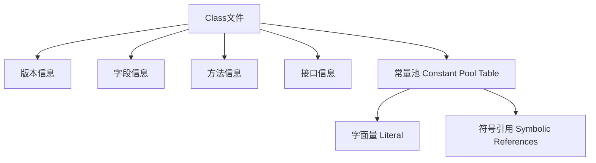
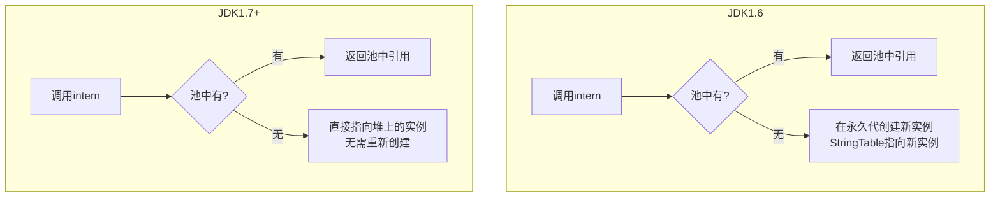
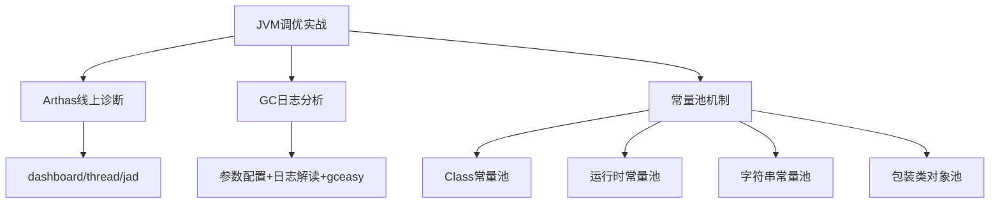

> 本文涵盖阿里开源神器 Arthas 的线上诊断实战、GC 日志的分析方法，并深度剖析 Class 常量池、运行时常量池、字符串常量池以及包装类对象池的底层原理与面试考点。

## 一、阿里巴巴 Arthas 详解

Arthas 是 Alibaba 在 2018 年 9 月开源的 **Java 诊断工具**，支持 JDK6+，采用命令行交互模式，可以方便地定位和诊断线上程序运行问题。

> 官方文档：[https://alibaba.github.io/arthas](https://alibaba.github.io/arthas)

### 1.1 Arthas 使用场景

- 是否有一个**全局视角**来查看系统的运行状况？
- 为什么 **CPU** 又升高了，到底是哪里占用了 CPU？
- 运行的**多线程有死锁**吗？有阻塞吗？
- 程序运行**耗时很长**，哪里耗时最长？如何监测？
- 这个类从**哪个 jar 包**加载的？为什么会报各种类相关的 Exception？
- 我改的代码**为什么没有执行**到？难道分支搞错了？
- 遇到问题无法在线上 debug，**只能通过加日志重新发布**？
- 有什么办法可以**监控 JVM 的实时运行状态**？

### 1.2 Arthas 安装与启动

```bash
# GitHub 下载
wget https://alibaba.github.io/arthas/arthas-boot.jar
# 或 Gitee 下载
wget https://arthas.gitee.io/arthas-boot.jar

# 启动
java -jar arthas-boot.jar
```

启动后 Arthas 会列出机器上所有 Java 进程，选择对应序号即可进入。


### 1.3 测试程序

以下程序同时模拟了 **CPU 过高**、**线程死锁**、**内存持续增长** 三种场景：

```java
public class ArthasDemo {
    private static HashSet<String> hashSet = new HashSet<>();

    public static void main(String[] args) {
        cpuHigh();          // 模拟 CPU 过高
        deadThread();        // 模拟线程死锁
        addHashSetThread();  // 模拟内存持续增长
    }

    public static void cpuHigh() {
        new Thread(() -> {
            while (true) {}  // 死循环占满 CPU
        }).start();
    }

    public static void addHashSetThread() {
        new Thread(() -> {
            int count = 0;
            while (true) {
                hashSet.add("count" + count);
                Thread.sleep(1000);
                count++;
            }
        }).start();
    }

    private static void deadThread() {
        Object resourceA = new Object();
        Object resourceB = new Object();
        // ThreadA: 先锁A再锁B
        new Thread(() -> {
            synchronized (resourceA) {
                Thread.sleep(1000);
                synchronized (resourceB) {
                    System.out.println("ThreadA get resourceB");
                }
            }
        }).start();
        // ThreadB: 先锁B再锁A → 死锁
        new Thread(() -> {
            synchronized (resourceB) {
                Thread.sleep(1000);
                synchronized (resourceA) {
                    System.out.println("ThreadB get resourceA");
                }
            }
        }).start();
    }
}
```

### 1.4 Arthas 核心命令


| 命令 | 功能 | 使用场景 |
|------|------|---------|
| `dashboard` | 查看进程运行全景（线程、内存、GC、运行时环境） | **全局监控入口** |
| `thread` | 查看所有线程详情 | 快速定位线程状态 |
| `thread <id>` | 查看指定线程堆栈 | 深入分析具体线程 |
| `thread -b` | 查看线程死锁 | **死锁排查** |
| `jad <类全名>` | 反编译线上代码 | **确认线上代码版本是否正确** |
| `ognl` | 执行表达式，可查看/修改运行时变量 | 动态调试 |
| `help` | 查看所有命令 | 探索更多功能 |

#### dashboard — 全局视图


#### thread — 线程分析

```
thread          # 查看所有线程
thread 1        # 查看线程ID=1的堆栈
thread -b       # 查看死锁
```


#### jad — 反编译

```
jad com.tuling.jvm.ArthasDemo
```

可以反编译线上类，确认代码是否是正确的版本——**再也不用担心忘了 commit 或者分支搞错了**。


---

## 二、GC 日志详解

### 2.1 开启 GC 日志

在 JVM 参数里添加：

```
-Xloggc:./gc-%t.log
-XX:+PrintGCDetails
-XX:+PrintGCDateStamps
-XX:+PrintGCTimeStamps
-XX:+PrintGCCause
-XX:+UseGCLogFileRotation
-XX:NumberOfGCLogFiles=10
-XX:GCLogFileSize=100M
```

完整启动命令（Tomcat 加在 JAVA_OPTS 里）：

```bash
java -jar -Xloggc:./gc-%t.log \
     -XX:+PrintGCDetails \
     -XX:+PrintGCDateStamps \
     -XX:+PrintGCTimeStamps \
     -XX:+PrintGCCause \
     -XX:+UseGCLogFileRotation \
     -XX:NumberOfGCLogFiles=10 \
     -XX:GCLogFileSize=100M \
     microservice-eureka-server.jar
```


### 2.2 GC 日志解读

下面是一段 JVM 刚启动时的 GC 日志示例：


```
2022-xx-xxTxx:xx:xx.xxx+0800: 2.909: [Full GC (Metadata GC Threshold)
    [PSYoungGen: 6160K->0K(141824K)]
    [ParOldGen: 112K->6056K(95744K)]
    6272K->6056K(237568K),
    [Metaspace: 20516K->20516K(1069056K)],
    0.0209707 secs]
```

逐段解读：

| 片段 | 含义 |
|------|------|
| `2022-xx-xxTxx:xx:xx.xxx+0800` | 发生时间 |
| `2.909` | JVM 启动后经过的秒数 |
| `Full GC (Metadata GC Threshold)` | GC 类型及**原因** |
| `PSYoungGen: 6160K->0K(141824K)` | 年轻代 GC 前→GC后（总大小） |
| `ParOldGen: 112K->6056K(95744K)` | 老年代 GC 前→GC后（总大小） |
| `6272K->6056K(237568K)` | 堆整体 GC 前→GC后（总大小） |
| `Metaspace: 20516K->20516K(1069056K)` | 元空间 GC 前→GC后（总大小） |
| `0.0209707 secs` | GC 总耗时 |

> 从日志发现几次 Full GC 都是因为元空间不够导致的 → **调大元空间**。

### 2.3 GC 日志调优示例

```
java -jar -Xloggc:./gc-adjust-%t.log \
     -XX:MetaspaceSize=256M -XX:MaxMetaspaceSize=256M \
     -XX:+PrintGCDetails -XX:+PrintGCDateStamps \
     ... \
     microservice-eureka-server.jar
```

调整后再看 GC 日志，已经没有因元空间不够导致的 Full GC 了。

### 2.4 CMS 与 G1 日志参数

**CMS**：

```
-Xloggc:d:/gc-cms-%t.log -Xms50M -Xmx50M
-XX:MetaspaceSize=256M -XX:MaxMetaspaceSize=256M
-XX:+PrintGCDetails -XX:+PrintGCDateStamps
-XX:+PrintGCTimeStamps -XX:+PrintGCCause
-XX:+UseGCLogFileRotation -XX:NumberOfGCLogFiles=10 -XX:GCLogFileSize=100M
-XX:+UseParNewGC -XX:+UseConcMarkSweepGC
```

**G1**：

```
-Xloggc:d:/gc-g1-%t.log -Xms50M -Xmx50M
-XX:MetaspaceSize=256M -XX:MaxMetaspaceSize=256M
-XX:+PrintGCDetails -XX:+PrintGCDateStamps
-XX:+PrintGCTimeStamps -XX:+PrintGCCause
-XX:+UseGCLogFileRotation -XX:NumberOfGCLogFiles=10 -XX:GCLogFileSize=100M
-XX:+UseG1GC
```

### 2.5 GC 日志可视化分析工具

推荐使用 [gceasy.io](https://gceasy.io)，上传 GC 文件后可获得可视化分析界面：


- 显示年轻代、老年代、永久代的内存分配和最大使用情况
- 显示堆内存在 GC 前后的变化趋势
- 提供基于机器学习的 JVM 智能优化建议（部分需付费）

### 2.6 JVM 参数汇总查看

```bash
java -XX:+PrintFlagsInitial  # 所有参数默认值
java -XX:+PrintFlagsFinal    # 运行时生效的值
```

---

## 三、Class 常量池与运行时常量池

### 3.1 Class 常量池

**Class 常量池**可理解为 Class 文件中的**资源仓库**，用于存放编译期生成的各种**字面量（Literal）**和**符号引用（Symbolic References）**。



一个 class 文件的十六进制结构如下：


通过 `javap -v Math.class` 可以生成更可读的字节码指令文件：


### 3.2 字面量

字面量是指由字母、数字等构成的字符串或数值常量，只能以**右值**出现。

```java
int a = 1;        // 1 是字面量
int b = 2;        // 2 是字面量
String c = "abc"; // "abc" 是字面量
```

### 3.3 符号引用

符号引用主要包括三类常量：

| 类型 | 说明 | 示例 |
|------|------|------|
| 类和接口的**全限定名** | 包名+类名 | `com/tuling/jvm/Math` |
| 字段的**名称和描述符** | 变量名+类型 | `a:I`、`user:Lcom/tuling/jvm/User` |
| 方法的**名称和描述符** | 方法名+参数+返回值 | `compute:()I`、`main:([Ljava/lang/String;)V` |

### 3.4 运行时常量池

常量池是**静态信息**，只有运行时被加载到内存后，符号引用才有对应的内存地址信息：

> Class 常量池一旦被装入内存就变成 **运行时常量池**，对应的符号引用在程序加载或运行时被转变为直接引用，也就是**动态链接**。

例如：`compute()` 这个符号引用在运行时会被转变为 compute() 方法具体代码在内存中的地址，主要通过**对象头的类型指针**去转换。

---

## 四、字符串常量池

### 4.1 设计思想

字符串的分配和其他对象一样耗费时间与空间。作为最基础的数据类型，大量频繁创建字符串会极大影响性能。

**JVM 优化策略**：

1. 开辟一个**字符串常量池**，类似缓存区
2. 创建字符串时，先查询常量池中是否存在该字符串
3. 存在则返回引用实例，不存在则实例化并放入池中

### 4.2 三种字符串操作（JDK 1.7+）

#### 直接赋值

```java
String s = "zhuge"; // s 指向常量池中的引用
```

只在常量池中创建对象。创建时先用 `equals(key)` 判断是否有相同对象——有则直接返回引用，无则创建并返回引用。

#### new String()

```java
String s1 = new String("zhuge"); // s1 指向堆内存中的对象引用
```

**保证字符串常量池和堆中都有这个对象**：

1. 检查常量池是否存在 `"zhuge"`
2. 不存在 → 先在常量池创建，再在堆中创建 → 返回堆引用
3. 存在 → 直接在堆中创建 → 返回堆引用

#### intern()

```java
String s1 = new String("zhuge");
String s2 = s1.intern();
System.out.println(s1 == s2); // false
```

`intern()` 是 native 方法：
- 如果常量池已包含 `equals` 相等的字符串 → 返回池中的字符串
- 否则（JDK 1.7+）→ 将 intern 返回的引用指向当前字符串 s1（JDK 1.6 需将 s1 复制到永久代）


### 4.3 字符串常量池位置演变

| JDK 版本 | 位置 |
|------|------|
| **JDK 1.6 及之前** | 永久代中的运行时常量池内 |
| **JDK 1.7** | 从永久代分离到**堆**中 |
| **JDK 1.8 及之后** | 运行时常量池在元空间，字符串常量池**仍在堆**中 |

**验证代码**：

```java
/**
 * -Xms10M -Xmx10M
 */
public class RuntimeConstantPoolOOM {
    public static void main(String[] args) {
        ArrayList<String> list = new ArrayList<>();
        for (int i = 0; i < 10000000; i++) {
            String str = String.valueOf(i).intern();
            list.add(str);
        }
    }
}
```

运行结果：
- **JDK 7+**：`java.lang.OutOfMemoryError: Java heap space`
- **JDK 6**：`java.lang.OutOfMemoryError: PermGen space`

> 这就证明了字符串常量池在堆中。

### 4.4 经典面试题分析

```java
String s1 = new String("he") + new String("llo");
String s2 = s1.intern();

System.out.println(s1 == s2);
// JDK 1.6: false，创建了 6 个对象
// JDK 1.7+: true，创建了 5 个对象
```

**JDK 1.6 vs JDK 1.7+ 的 intern() 差异**：



### 4.5 String 常量池示例大全

#### 示例 1：编译期常量拼接

```java
String s0 = "zhuge";
String s1 = "zhuge";
String s2 = "zhu" + "ge";
System.out.println(s0 == s1); // true
System.out.println(s0 == s2); // true
```

> 编译期确定：多个字符串常量拼接 → 编译器优化为一个常量 → 都指向常量池同一引用。

#### 示例 2：new String() 无法在编译期确定

```java
String s0 = "zhuge";
String s1 = new String("zhuge");
String s2 = "zhu" + new String("ge");
System.out.println(s0 == s1); // false
System.out.println(s0 == s2); // false
System.out.println(s1 == s2); // false
```

> new String() 创建的对象在运行时分配，不放入常量池，有自己的地址空间。

#### 示例 3：基础类型常量拼接

```java
String a = "a1";
String b = "a" + 1;
System.out.println(a == b); // true

String c = "a3.4";
String d = "a" + 3.4;
System.out.println(c == d); // true
```

> JVM 编译期将字符串常量的 `+` 连接优化为连接后的值。

#### 示例 4：变量参与拼接

```java
String a = "ab";
String bb = "b";
String b = "a" + bb;
System.out.println(a == b); // false
```

> 引用值在编译期无法确定，运行时动态分配。

#### 示例 5：final 修饰的变量

```java
String a = "ab";
final String bb = "b";
String b = "a" + bb;
System.out.println(a == b); // true
```

> `final` 修饰的变量在编译时被解析为常量值本地拷贝，效果等同于常量拼接。

#### 示例 6：final + 方法返回值

```java
String a = "ab";
final String bb = getBB();  // 方法返回值，编译期无法确定
String b = "a" + bb;
System.out.println(a == b); // false

private static String getBB() {
    return "b";
}
```

> 方法返回值编译期无法确定 → 运行时动态连接。

### 4.6 String 的不变性

```java
String s = "a" + "b" + "c";     // 等价于 String s = "abc";
String s1 = a + b + c;           // 编译为 StringBuilder 拼接
```

`s1` 的 `+` 操作实际编译为：

```java
StringBuilder temp = new StringBuilder();
temp.append(a).append(b).append(c);
String s = temp.toString();
```

### 4.7 进阶示例

```java
// 示例1：堆上有但池中没有
String str2 = new StringBuilder("计算机").append("技术").toString();
System.out.println(str2 == str2.intern()); // true
// 池中没有"计算机技术"，intern时直接返回堆中引用

// 示例2："java"是关键字，早已被JVM放入池中
String str1 = new StringBuilder("ja").append("va").toString();
System.out.println(str1 == str1.intern()); // false
// "java"在JVM初始化时就已进入常量池

// 示例3：字面量在池中
String s1 = new String("test");
System.out.println(s1 == s1.intern()); // false
// "test"作为字面量已在池中，new创建的s1在堆中
```

---

## 五、八种基本类型的包装类与对象池

大部分包装类实现了**常量池技术**（严格说是**对象池**，在堆上）：

| 包装类 | 是否实现对象池 | 缓存范围 |
|------|:------:|------|
| Byte | ✅ | -128 ~ 127 |
| Short | ✅ | -128 ~ 127 |
| Integer | ✅ | -128 ~ 127 |
| Long | ✅ | -128 ~ 127 |
| Character | ✅ | 0 ~ 127 |
| Boolean | ✅ | true / false |
| Float | ❌ | — |
| Double | ❌ | — |

```java
public class Test {
    public static void main(String[] args) {
        // 值在缓存范围内 → 对象池
        Integer i1 = 127;  // 实际调用 Integer.valueOf(127)
        Integer i2 = 127;
        System.out.println(i1 == i2); // true

        // 值超出缓存范围 → 新对象
        Integer i3 = 128;
        Integer i4 = 128;
        System.out.println(i3 == i4); // false

        // new 关键词 → 不使用对象池
        Integer i5 = new Integer(127);
        Integer i6 = new Integer(127);
        System.out.println(i5 == i6); // false

        // Boolean 实现了对象池
        Boolean bool1 = true;
        Boolean bool2 = true;
        System.out.println(bool1 == bool2); // true

        // 浮点类型没有对象池
        Double d1 = 1.0;
        Double d2 = 1.0;
        System.out.println(d1 == d2); // false
    }
}
```

> 自动装箱 `Integer i = 127` 实际调用 `Integer.valueOf(127)`，内部使用了 **IntegerCache** 对象池。


---

## 六、总结



| 知识点 | 核心要点 |
|------|---------|
| **Arthas** | dashboard 全局监控、jad 反编译验证代码、thread -b 查死锁 |
| **GC 日志** | 参数配置 → 分段解读 → gceasy 可视化 → 针对性调优 |
| **Class 常量池** | 字面量 + 符号引用，编译期静态信息 |
| **运行时常量池** | 类加载后将符号引用转换为直接引用（动态链接） |
| **字符串常量池** | JDK 7 起移到堆中，intern() 行为因版本而异（经典面试题） |
| **编译期优化** | 常量拼接、final 变量 → 编译期确定；变量拼接 → 运行时 StringBuilder |
| **包装类对象池** | Integer 等 [-128,127] 范围内使用缓存，Float/Double 无缓存 |
