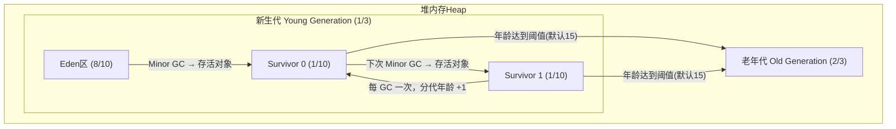

理解了 JVM 的整体架构和类加载机制之后，下一步自然就是深入 JVM 的内存模型。内存是 JVM 调优中最常打交道的部分——线上 OOM、频繁 GC、服务卡顿，根因往往都藏在内存里。这篇文章带你从体系结构一路深入到参数调优实战。

---

## 一、JDK 体系结构与跨平台特性

在深入 JVM 内存模型之前，先看一张全景图——JDK 的完整体系结构。


从上图可以清楚地看到：**JRE（Java Runtime Environment）** 是 Java 程序的运行时环境，包含 JVM 和核心类库；**JDK（Java Development Kit）** 则是在 JRE 之上叠加了开发工具（javac、jar、javadoc 等）。而 JVM 正是这整个体系中最核心的执行引擎。

那么 Java 引以为豪的"一次编写，到处运行"是怎么做到的？


答案就在 **字节码（Bytecode）** 这个中间层。Java 源码 `.java` 经过 `javac` 编译后生成 `.class` 字节码文件，这个字节码不面向任何具体的操作系统或硬件，而是面向 JVM。不同平台上的 JVM 实现负责将同一份字节码翻译成本地机器指令。这就是跨平台的本质——**JVM 充当了中间适配层**。

> **一句话总结**：Java 的跨平台不是因为 Java 语言本身，而是因为 JVM 为不同平台屏蔽了底层差异。

---

## 二、JVM 整体结构及内存模型

JVM 的内存结构是理解一切内存问题的基础。先看这张经典的 JVM 整体架构图：


从上图可以看出，JVM 内存主要划分为以下几个区域：

### 2.1 线程私有区域

| 区域 | 说明 | 常见异常 |
|------|------|----------|
| **程序计数器（PC Register）** | 指向当前线程正在执行的字节码指令地址，唯一不会 OOM 的区域 | 无 |
| **虚拟机栈（JVM Stack）** | 每个方法执行时创建栈帧，存储局部变量表、操作数栈、动态链接、返回地址 | `StackOverflowError` |
| **本地方法栈（Native Method Stack）** | 为 Native 方法服务，与虚拟机栈类似 | `StackOverflowError` |

### 2.2 线程共享区域

| 区域 | 说明 | 常见异常 |
|------|------|----------|
| **堆（Heap）** | 存放对象实例，GC 的主战场，分为新生代和老年代 | `OutOfMemoryError: Java heap space` |
| **元空间（MetaSpace）** | 存放类的元数据信息（JDK8+ 替代永久代），使用本地内存 | `OutOfMemoryError: MetaSpace` |

**堆的细分结构**（分代收集模型）：



---

## 三、JVM 内存参数设置

JVM 内存参数是调优的"控制旋钮"。Spring Boot 程序的典型 JVM 参数设置如下：


```
java -Xms2048M -Xmx2048M -Xmn1024M -Xss512K -XX:MetaspaceSize=256M -XX:MaxMetaspaceSize=256M -jar microservice-eureka-server.jar
```

各参数含义：

| 参数 | 含义 | 示例值 |
|------|------|--------|
| `-Xms` | 堆内存初始大小 | 2048M |
| `-Xmx` | 堆内存最大大小 | 2048M |
| `-Xmn` | 新生代大小 | 1024M |
| `-Xss` | 每个线程的栈大小 | 512K（默认 1M） |
| `-XX:MetaspaceSize` | 元空间触发 Full GC 的初始阈值 | 256M |
| `-XX:MaxMetaspaceSize` | 元空间最大值 | 256M |

> **建议**：`-Xms` 和 `-Xmx` 设置成一样大，避免堆内存动态扩缩带来的性能开销。这一点在生产环境尤为重要。

### 3.1 元空间参数详解

关于元空间有两个关键参数：`-XX:MetaspaceSize=N` 和 `-XX:MaxMetaspaceSize=N`。

- **`-XX:MaxMetaspaceSize`**：设置元空间最大值，默认是 `-1`（不限制），只受限于本地内存大小。
- **`-XX:MetaspaceSize`**：指定元空间触发 Full GC 的初始阈值，默认是 **21M**。当元空间使用量达到该值时会触发 Full GC 进行类型卸载，同时 GC 收集器会对该值进行动态调整：
  - 释放了大量空间 → 适当**降低**该值
  - 释放了很少空间 → 在不超 `MaxMetaspaceSize` 的前提下适当**提高**该值

这与早期 JDK 版本的 `-XX:PermSize` 含义不同——`PermSize` 代表永久代的**初始容量**，而 `MetaspaceSize` 是触发 GC 的**阈值**。

> **实战建议**：调整元空间大小需要 Full GC，这是非常昂贵的操作。如果应用在启动时频繁 Full GC，通常都是元空间在动态调整大小。对于 8G 物理内存的机器，建议将 `MetaspaceSize` 和 `MaxMetaspaceSize` **设置为相同的值**（如 256M），避免运行时动态调整。

---

## 四、StackOverflowError 案例解析

线程栈的大小由 `-Xss` 控制。下面通过一个经典案例来直观感受：

```java
// JVM设置  -Xss128k（默认1M）
public class StackOverflowTest {
    
    static int count = 0;
    
    static void redo() {
        count++;
        redo();
    }
    
    public static void main(String[] args) {
        try {
            redo();
        } catch (Throwable t) {
            t.printStackTrace();
            System.out.println(count);
        }
    }
}
```

**运行结果**：

```
java.lang.StackOverflowError
    at com.tuling.jvm.StackOverflowTest.redo(StackOverflowTest.java:12)
    at com.tuling.jvm.StackOverflowTest.redo(StackOverflowTest.java:13)
    at com.tuling.jvm.StackOverflowTest.redo(StackOverflowTest.java:13)
    ......
```

**结论**：`-Xss` 设置越小，`count` 值越小——说明一个线程栈里能分配的**栈帧就越少**。但反过来，每个线程占用的内存少了，JVM 整体能创建的**线程数就会更多**。

> **权衡之道**：栈大小是一个典型的取舍问题——栈太小容易 StackOverflow，栈太大则限制并发线程数。一般 512K 到 1M 是合理的范围。

---

## 五、实战：日均百万级订单交易系统 JVM 参数设置

JVM 参数并没有放之四海皆准的标准，需要结合具体场景分析。这里以**日均百万级订单交易系统**为例，演示参数设置的思路。


### 5.1 场景分析

| 维度 | 特征 |
|------|------|
| **业务特点** | 高并发下单、订单状态流转、库存扣减 |
| **对象特征** | 大量短生命周期对象（Request/Response、订单临时对象） |
| **核心诉求** | 低延迟、避免 Full GC 导致的 STW 停顿 |

### 5.2 参数设置思路

**第一步：确定堆大小**

假设服务器物理内存 8G，操作系统自身 + 其他服务预留 2~3G，JVM 可用约 5~6G。堆内存建议不超过物理内存的一半，取 **4G**：

```
-Xms4096M -Xmx4096M
```

**第二步：确定新生代大小**

订单系统大量对象朝生夕死，新生代要足够大，防止对象过早晋升到老年代。新生代与老年代比例通常 1:2，这里可以适当加大新生代，取 1:1：

```
-Xmn2048M
```

**第三步：确定栈大小**

百万级订单意味着高并发，线程数不会太少。栈大小设为 **512K** 以支持更多线程：

```
-Xss512K
```

**第四步：确定元空间**

参考前文建议，大小固定避免动态调整：

```
-XX:MetaspaceSize=256M -XX:MaxMetaspaceSize=256M
```

### 5.3 完整参数

```
java -Xms4096M -Xmx4096M -Xmn2048M -Xss512K \
     -XX:MetaspaceSize=256M -XX:MaxMetaspaceSize=256M \
     -XX:+PrintGCDetails -XX:+PrintGCDateStamps \
     -Xloggc:/path/to/gc.log \
     -jar order-service.jar
```

---

## 六、总结

通过本文对 JVM 内存模型的深度剖析，核心结论可以归纳为三条原则：

1. **尽量让对象在新生代分配和回收**：这是 GC 优化最核心的思路。新生代的 Minor GC 速度快、停顿短，老年代的 Full GC 代价大得多。

2. **避免频繁让对象进入老年代**：大对象直接进老年代、Survivor 空间不够导致过早晋升，这些都是需要避免的情况。合理设置新生代大小和 Survivor 比例是关键。

3. **给系统充足但不浪费的内存**：内存太大浪费资源、GC 停顿时间长；内存太小导致频繁 GC。**堆内存不超过物理内存的一半是一个安全的起点**。

内存优化不是一次性工作，而是**持续观察、持续调整**的过程。善用 GC 日志、Arthas、jstat 等工具，让数据说话，而不是凭感觉调参。

---

