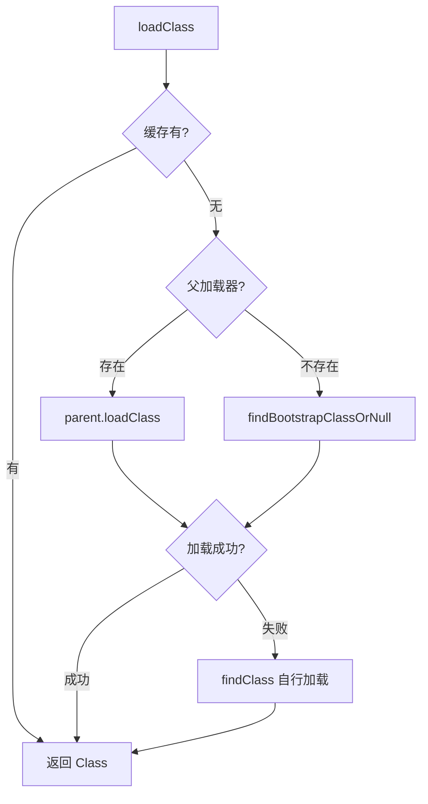
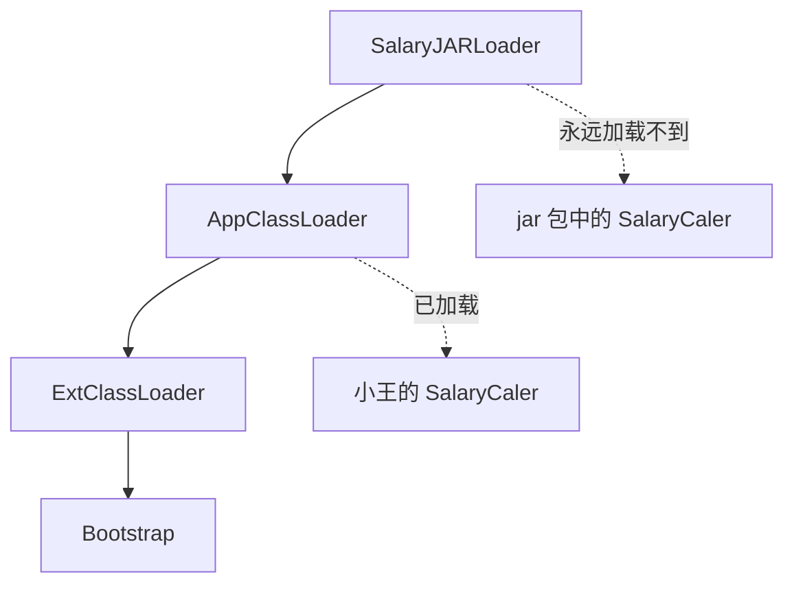
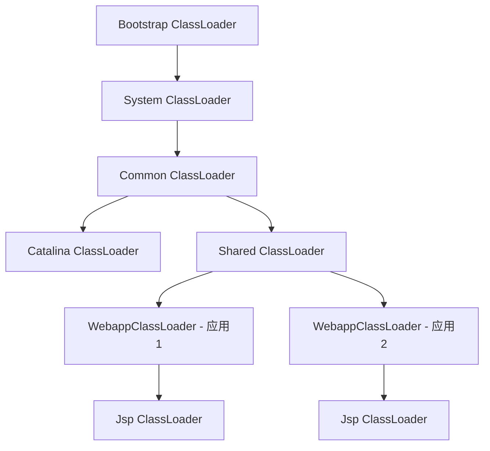

Java 类加载机制是 JVM 的门户，我们编写的 Class 文件都需要经过类加载器加载到 JVM 中才能执行。这篇文章通过一个"程序员偷偷加薪"的故事，全面梳理类加载机制能给我们的业务编码带来哪些实际帮助。

---

## 一、快速梳理 Java 类加载机制

三句话总结 JDK8 的类加载机制：

1. **类缓存**：每个类加载器对他加载过的类都有一个缓存。
2. **双亲委派**：向上委托查找，向下委托加载。
3. **沙箱保护**：不允许应用程序加载 JDK 内部的系统类。

### 1.1 JDK8 的类加载体系

先来看一段代码，直观感受 JDK8 的类加载体系：

```java
public class LoaderDemo {
    public static String a = "aaa";

    public static void main(String[] args) throws ClassNotFoundException {
        // 父子关系: AppClassLoader <- ExtClassLoader <- BootStrap Classloader
        ClassLoader cl1 = LoaderDemo.class.getClassLoader();
        System.out.println("cl1 > " + cl1);
        System.out.println("parent of cl1 > " + cl1.getParent());
        // BootStrap Classloader 由 C++ 开发，是 JVM 虚拟机的一部分，本身不是 JAVA 类
        System.out.println("grant parent of cl1 > " + cl1.getParent().getParent());
        // String, Int 等基础类由 BootStrap Classloader 加载
        ClassLoader cl2 = String.class.getClassLoader();
        System.out.println("cl2 > " + cl2);
        System.out.println(cl1.loadClass("java.util.List").getClass().getClassLoader());

        // 启动参数 -verbose:class -verbose:gc 可以打印出类加载情况
        System.out.println("BootStrap ClassLoader加载目录：" + System.getProperty("sun.boot.class.path"));
        System.out.println("Extention ClassLoader加载目录：" + System.getProperty("java.ext.dirs"));
        System.out.println("AppClassLoader加载目录：" + System.getProperty("java.class.path"));
    }
}
```

JDK8 中类加载器分为两种视角来看：

```mermaid
graph TD
    subgraph 左侧：对象视角（parent关系）
        B[Bootstrap ClassLoader - C++ 实现]
        E[ExtClassLoader]
        A[AppClassLoader]
        C[自定义 ClassLoader]
    end
    
    subgraph 右侧：类继承视角
        CL[ClassLoader - 抽象类]
        SCL[SecureClassLoader]
        URLCL[URLClassLoader]
        EXT[ExtClassLoader]
        APP[AppClassLoader]
    end
```

| 类加载器 | 加载路径 | 说明 |
|---------|---------|------|
| **Bootstrap ClassLoader** | `sun.boot.class.path` | C++ 实现，加载 Java 基础类，是 JVM 的一部分 |
| **ExtClassLoader** | `java.ext.dirs` | 加载扩展类，可通过 `-D java.ext.dirs` 指定 |
| **AppClassLoader** | `java.class.path` | 加载应用 classpath 下的 Jar 包和类 |

> 简而言之：左侧是对象，右侧是类。应用中自定义的类加载器的 parent 都是 AppClassLoader。

### 1.2 双亲委派机制

JDK8 中所有类加载器都继承自 `ClassLoader`，核心加载方法 `loadClass()` 如下：

```java
protected Class<?> loadClass(String name, boolean resolve) throws ClassNotFoundException {
    synchronized (getClassLoadingLock(name)) {
        // 1. 先去缓存中查看有没有加载过
        Class<?> c = findLoadedClass(name);
        if (c == null) {
            long t0 = System.nanoTime();
            try {
                // 2. 没有加载过，走双亲委派：找父类加载器加载
                if (parent != null) {
                    c = parent.loadClass(name, false);
                } else {
                    c = findBootstrapClassOrNull(name);
                }
            } catch (ClassNotFoundException e) {
                // 父加载器加载不到继续往下
            }
            if (c == null) {
                long t1 = System.nanoTime();
                // 3. 父加载器都没加载到，自行解析 class 文件加载
                c = findClass(name);
            }
        }
        // 4. resolveClass 是 Linking 链接过程（验证、准备、解析）
        if (resolve) {
            resolveClass(c);
        }
        return c;
    }
}
```



> 关键点：`loadClass()` 是 `protected` 的，意味着子类**可以覆盖它**。所以，双亲委派机制是可以被打破的。

### 1.3 沙箱保护机制

双亲委派最大的作用是保护 JDK 内部核心类不被应用覆盖。JDK 还在此基础上加了一层保险——`preDefineClass()` 方法：

```java
private ProtectionDomain preDefineClass(String name, ProtectionDomain pd) {
    if (!checkName(name))
        throw new NoClassDefFoundError("IllegalName: " + name);
    // 不允许加载核心类
    if ((name != null) && name.startsWith("java.")) {
        throw new SecurityException("Prohibited package name: "
            + name.substring(0, name.lastIndexOf('.')));
    }
    // ...
}
```

这也解释了为什么 JDK 中有很多 `javax` 开头的包——和沙箱保护机制的历史有关。

### 1.4 Linking 链接过程与半初始化状态

`loadClass` 中的 `resolveClass` 是一个 native 方法，实现的过程称为 Linking 链接：


**半初始化状态**是理解类加载的关键概念：JVM 处理 `static` 静态属性时，会先给一个默认值占住内存，等链接完成后，才在初始化阶段将静态属性改为指定的初始值。

> 注意：`static` 属性属于类，在 `<cinit>` 中初始化；普通属性属于对象，在 `<init>` 中初始化。不要搞混。

看下面这个案例：

```java
class Apple {
    static Apple apple = new Apple(10);
    static double price = 20.00;
    double totalpay;

    public Apple(double discount) {
        System.out.println("====" + price);
        totalpay = price - discount;
    }
}

public class PriceTest01 {
    public static void main(String[] args) {
        System.out.println(Apple.apple.totalpay);
    }
}
```

程序打印结果是 **-10**，而不是 10。为什么？

当 `Apple.apple` 触发类初始化时：
1. **准备阶段**：`apple = null`，`price = 0.0`（默认值）
2. **初始化阶段**：按顺序执行——先 `apple = new Apple(10)`，此时构造方法中 `price` 还是 0，所以 `totalpay = 0 - 10 = -10`
3. 然后才 `price = 20.00`

这就是半初始化状态导致的反直觉结果。

关于解析过程，两个核心概念：
- **符号引用**：类初始化前，A 类引用 B 类时不知道 B 的具体地址，只能创建一个象征性的引用
- **直接引用**：A 和 B 都完成初始化后，符号引用被替换为指向 B 类真实内存地址的引用

---

## 二、故事开头：一个用类加载机制加薪的故事

故事背景：模拟一个 OA 系统，每个月需要定时计算大家的工资。

```java
public class OADemo1 {
    public static void main(String[] args) throws InterruptedException {
        Double salary = 15000.00;
        Double money = 0.00;
        while (true) {  // 模拟不停机运行
            try {
                money = calSalary(salary);
                System.out.println("实际到手Money:" + money);
            } catch (Exception e) {
                System.out.println("加载出现异常：" + e.getMessage());
            }
            Thread.sleep(5000);
        }
    }

    private static Double calSalary(Double salary) {
        SalaryCaler caler = new SalaryCaler();
        return caler.cal(salary);
    }
}
```

计算工资的方法交由独立的 `SalaryCaler` 类处理：

```java
public class SalaryCaler {
    public Double cal(Double salary) {
        return salary;  // 正常情况：原价发放
    }
}
```

这时，程序员老王想偷偷给大家都加一点工资：

```java
public class SalaryCaler {
    public Double cal(Double salary) {
        return salary * 1.4;  // 老王：偷偷加 40%
    }
}
```

但经理肯定会发现。于是程序员与资本家的斗智斗勇，就此展开。

---

## 三、第一招：通过类加载器引入外部 Jar 包

老王的想法：把计算工资的方法从 OA 系统抽出来，放到一个外部 jar 包中，绕开经理的代码审查。

使用 JDK 提供的 **URLClassLoader**，可以从 jar 包中加载类：

```java
public class OADemo2 {
    public static void main(String[] args) throws Exception {
        Double salary = 15000.00;
        Double money = 0.00;

        URL jarPath = new URL("file:/path/to/SalaryCaler.jar");
        URLClassLoader urlClassLoader = new URLClassLoader(new URL[] {jarPath});

        while (true) {
            try {
                money = calSalary(salary, urlClassLoader);
                System.out.println("实际到手Money:" + money);
            } catch (Exception e) {
                e.printStackTrace();
            }
            Thread.sleep(5000);
        }
    }

    private static Double calSalary(Double salary, ClassLoader classloader) throws Exception {
        Class<?> clazz = classloader.loadClass("com.roy.oa.SalaryCaler");
        if (null != clazz) {
            Object object = clazz.newInstance();
            return (Double) clazz.getMethod("cal", Double.class).invoke(object, salary);
        }
        return -1.00;
    }
}
```

**真实项目中的应用场景**：
- 流程统一但规则频繁变化的场景：规则引擎、审批规则、订单状态规则等
- URLClassLoader 可以从远程 Web 服务器加载 Jar 包
- Drools 规则引擎就实现了从 Maven 仓库远程加载核心规则文件

---

## 四、第二招：自定义类加载器实现 Class 代码混淆

经理虽然看不到源码了，但通过 OA 系统的引用路径还是能找到那个 jar 包，反编译一下源码就暴露了。老王还需要对 class 文件进行加密混淆。

**两个思路**：

1. **修改文件后缀**：从 `.class` 改为 `.myclass`，像把游戏软件改成 `.txt` 一样
2. **修改二进制内容**：改动 class 文件的二进制数据，让标准反编译工具失效

JDK 只能加载标准 class 文件，所以需要自定义类加载器。

首先，定义一个自定义类加载器，实现从 `.myclass` 文件中加载类：

```java
public class SalaryClassLoader extends SecureClassLoader {
    private String classPath;

    public SalaryClassLoader(String classPath) {
        this.classPath = classPath;
    }

    @Override
    protected Class<?> findClass(String fullClassName) throws ClassNotFoundException {
        // 查找 .myclass 文件
        String filePath = this.classPath + fullClassName.replace(".", "/").concat(".myclass");
        try {
            FileInputStream fis = new FileInputStream(filePath);
            ByteArrayOutputStream bos = new ByteArrayOutputStream();
            int code;
            while ((code = fis.read()) != -1) {
                bos.write(code);
            }
            byte[] data = bos.toByteArray();
            bos.close();
            // 调用 defineClass 将二进制数组转化为 JVM 中的类
            return defineClass(fullClassName, data, 0, data.length);
        } catch (Exception e) {
            e.printStackTrace();
        }
        return null;
    }
}
```

然后对 class 文件做简单加密——在文件头部插入一个无意义的字节：

```java
public class FileTransferTest {
    public static void main(String[] args) throws Exception {
        FileInputStream fis = new FileInputStream("SalaryCaler.class");
        FileOutputStream fos = new FileOutputStream("SalaryCaler.myclass");

        fos.write(1);  // 在文件头部写入一个无意义的 1
        int code;
        while ((code = fis.read()) != -1) {
            fos.write(code);
        }
        fis.close();
        fos.close();
    }
}
```

这样经理即使拿到 `.myclass` 文件也无法直接反编译。自定义类加载器只需要在读取时跳过第一个字节即可。

**进一步提升安全性**：
- 使用 MD5、对称加密、非对称加密等算法替代简单的字节偏移
- 甚至可以连类加载器自身也加密——用类加载器 A 从加密 class 加载出类加载器 B，再用 B 加载核心代码

**在真实项目中的落地**：项目部署使用 jar 包，自定义类加载器需要从 jar 包中读取 class 文件：

```java
public class SalaryJARLoader extends SecureClassLoader {
    private String jarFile;

    public SalaryJARLoader(String jarFile) {
        this.jarFile = jarFile;
    }

    @Override
    protected Class<?> findClass(String fullClassName) throws ClassNotFoundException {
        String classFilepath = fullClassName.replace('.', '/').concat(".class");
        System.out.println("重新加载类：" + classFilepath);
        try {
            URL jarURL = new URL("jar:file:" + jarFile + "!/" + classFilepath);
            URLConnection urlConnection = jarURL.openConnection();
            urlConnection.setUseCaches(false);  // 不使用缓存，否则 jar 包无法热更新
            InputStream is = urlConnection.getInputStream();
            ByteArrayOutputStream bos = new ByteArrayOutputStream();
            int code;
            while ((code = is.read()) != -1) {
                bos.write(code);
            }
            byte[] data = bos.toByteArray();
            is.close();
            bos.close();
            return defineClass(fullClassName, data, 0, data.length);
        } catch (Exception e) {
            throw new ClassNotFoundException(e.getMessage());
        }
    }
}
```

---

## 五、第三招：自定义类加载器实现热加载

老王虽然瞒过了经理，但总公司会不定期核算工资。他需要在总公司核查前把计算方式改回去，核查完再改回来——这就需要一个**不停机**的热加载方案。

直接修改 jar 包后，老王发现必须重启 OA 系统才能生效。原因很简单：`SalaryJARLoader` 对它加载过的类保存了缓存，而这个缓存是 **JVM 层面**实现的，Java 代码接触不到。

解决方案也很直接：**每次都创建一个新的类加载器对象**，新对象的缓存必然是空的，自然就只能重新从 jar 包读取了：

```java
public class OADemo5 {
    public static void main(String[] args) throws Exception {
        Double salary = 15000.00;
        Double money = 0.00;

        while (true) {
            try {
                money = calSalary(salary);
                System.out.println("实际到手Money:" + money);
            } catch (Exception e) {
                System.out.println("加载出现异常：" + e.getMessage());
            }
            Thread.sleep(5000);
        }
    }

    private static Double calSalary(Double salary) throws Exception {
        // 每次调用都创建一个新的类加载器
        SalaryJARLoader salaryClassLoader = new SalaryJARLoader("/path/to/SalaryCaler.jar");
        Class<?> clazz = salaryClassLoader.loadClass("com.roy.oa.SalaryCaler");
        if (null != clazz) {
            Object object = clazz.newInstance();
            return (Double) clazz.getMethod("cal", Double.class).invoke(object, salary);
        }
        return -1.00;
    }
}
```

这样老王就可以随时切换 jar 包，实现热更新了。

**补充知识点——懒加载**：打印 SalaryJARLoader 加载过的类，你会发现加载 `SalaryCaler` 时，不光加载了这个类，还同时加载了 `Double` 和 `Object`。这就是 JVM 的**懒加载机制**——并不是在启动时一次性加载所有类，而是用到时才加载。

**热加载的代价**：这种机制会创建大量 ClassLoader 对象，废弃的加载器及其缓存会成为元数据区的垃圾，极大增加 GC 压力。不过在开发阶段，IDEA 的 JRebel 插件和 Arthas 也实现了类似的热更新机制。

---

## 六、第四招：打破双亲委派，实现同类多版本共存

正当老王得意时，新手程序员小王在 OA 系统里也提交了一个 `SalaryCaler` 类。老王的 jar 包热加载突然失效了——不管怎么更新，OA 系统始终只加载小王提交的那个类。

**原因**：自定义的 `SalaryJARLoader` 的 parent 指向 `AppClassLoader`，而 `AppClassLoader` 会加载 OA 系统的所有代码，自然包括小王的 `SalaryCaler`。按照双亲委派机制，jar 包中的同名类永远没有机会被加载。



要解决问题，只能对双亲委派下手——**打破它**。思路是让 jar 包中的类优先于父加载器被加载：

```java
public class SalaryJARLoader6 extends SecureClassLoader {
    private String jarFile;

    public SalaryJARLoader6(String jarFile) {
        this.jarFile = jarFile;
    }

    @Override
    public Class<?> loadClass(String name, boolean resolve) throws ClassNotFoundException {
        // 打破双亲委派：先到子类加载器中加载，加载不到再去父类加载器
        Class<?> c = null;
        synchronized (getClassLoadingLock(name)) {
            c = findLoadedClass(name);
            if (c == null) {
                c = findClass(name);   // 先自己尝试加载
                if (c == null) {
                    c = super.loadClass(name, resolve);  // 加载不到再走双亲委派
                }
            }
        }
        return c;
    }

    // findClass 实现同 SalaryJARLoader，省略...
}
```

**关于沙箱保护**：即使打破了双亲委派，也无法绕过 JDK 的沙箱保护机制。因为 JDK 内部三个类加载器的实现是改不了的，核心类始终安全。JDK9 引入模块化后，内部加载机制发生了翻天覆地的变化，但对于自定义类加载器，双亲委派机制依然保留。

**真实项目中的双亲委派打破场景——Tomcat**：



| 类加载器 | 作用 |
|---------|------|
| **CommonLoader** | 最基本的类加载器，Tomcat 容器和所有 Webapp 都可见 |
| **CatalinaLoader** | Tomcat 容器私有，Webapp 不可见 |
| **SharedLoader** | 所有 Webapp 共享，Tomcat 容器不可见 |
| **WebappClassLoader** | 每个 Webapp 私有，实现不同应用的类隔离（如各自加载不同版本的 Spring） |
| **Jsp ClassLoader** | 每个 JSP 页面对应一个加载器，修改 JSP 即创建新加载器，实现 JSP 热加载 |

**SpringBoot 的 SPI 机制**也与类加载器深度绑定。例如：

```java
List<String> names = SpringFactoriesLoader.loadFactoryNames(
    ApplicationContextInitializer.class, null);
```

`loadFactoryNames` 的第二个参数就是要传一个 ClassLoader——SpringBoot 框架的秘密，都在它的 SPI 配置文件 `META-INF/spring.factories` 中。

---

## 七、终极优化：用 SPI 机制摆脱反射

经过上面的层层演进，老王的 OA 系统中同时存在了两个 `SalaryCaler`：

- AppClassLoader 中的 `SalaryCaler`——可以正常 `new` 出来
- SalaryJARLoader 中的 `SalaryCaler`——只能通过别扭的反射使用

老王想让 jar 包中的类也像普通类一样使用，于是尝试类型强转：

```java
SalaryCaler caler2 = (SalaryCaler) obj;  // 来自 jar 包的 SalaryCaler
```

结果得到一个让人怀疑人生的异常：

```
Exception in thread "main" java.lang.ClassCastException:
    com.roy.oa.SalaryCaler cannot be cast to com.roy.oa.SalaryCaler
```

> 我不能转换成我自己？那我到底是谁？

原因：JVM 中类的唯一性由 **类加载器 + 全类名** 共同决定。两个不同类加载器加载的同名类，在 JVM 看来是两个完全不同的类。

解决方案——**利用 JDK 的 SPI 机制**：

```java
// 定义统一的接口
public interface SalaryCalService {
    Double cal(Double salary);
}

// jar 包中提供实现（在 META-INF/services 下配置）
public class SalaryCalImpl implements SalaryCalService {
    public Double cal(Double salary) {
        return salary * 1.4;
    }
}
```

使用时通过 ServiceLoader 加载，摆脱反射：

```java
public class OADemo8 {
    private static SalaryCalService getSalaryService(ClassLoader classloader) {
        ServiceLoader<SalaryCalService> services;
        if (null == classloader) {
            services = ServiceLoader.load(SalaryCalService.class);
        } else {
            // 切换当前线程的上下文类加载器
            ClassLoader c1 = Thread.currentThread().getContextClassLoader();
            Thread.currentThread().setContextClassLoader(classloader);
            services = ServiceLoader.load(SalaryCalService.class);
            Thread.currentThread().setContextClassLoader(c1);
        }
        Iterator<SalaryCalService> iterator = services.iterator();
        return iterator.hasNext() ? iterator.next() : null;
    }
}
```

这样虽然多定义了一个接口，但至少摆脱了别扭的反射代码。许多开源框架（ShardingSphere、SpringBoot 等）都大量运用 SPI 机制来保留功能扩展点。

---

## 总结

这篇文章通过一个虚构的"加薪"故事，串联了类加载机制的核心玩法：

| 关卡 | 问题 | 解决方案 | 核心知识点 |
|------|------|---------|-----------|
| 第一招 | 经理审查源码 | 外部 Jar 包加载 | URLClassLoader |
| 第二招 | 经理反编译 Jar | Class 加密混淆 | 自定义 ClassLoader + 文件流加密 |
| 第三招 | 需要不停机切换 | 热加载 | 每次创建新 ClassLoader 实例 |
| 第四招 | 同名类冲突 | 打破双亲委派 | 重写 loadClass，子加载器优先 |
| 优化 | 反射太别扭 | SPI 机制 | ServiceLoader + 接口抽象 |

类加载机制是 JVM 中最有趣的部分之一——它是少数几个可以在 Java 代码中扩展的 JVM 底层功能。底层的影响范围最广，Tomcat、SpringBoot、ShardingSphere 等框架都在类加载机制上做了大量定制。

> 闲时打磨技术，机会一到，升职加薪自然水到渠成。
