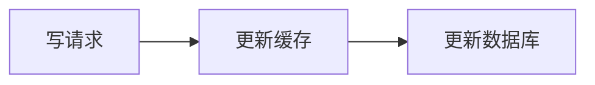
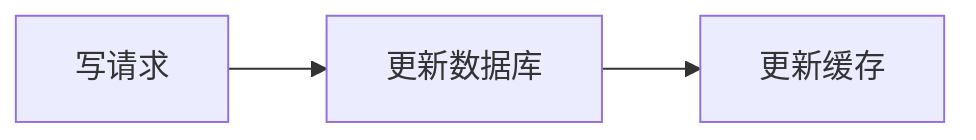
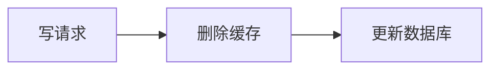
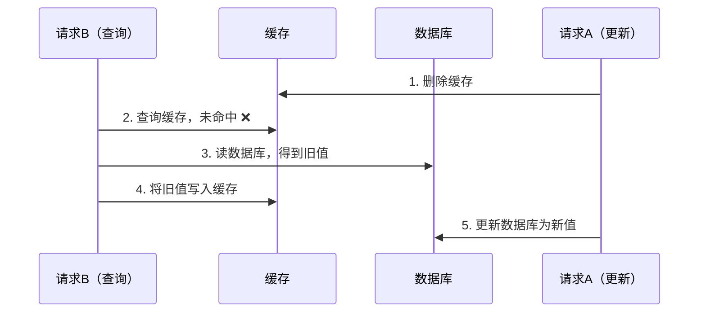
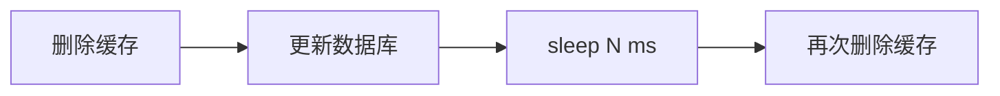
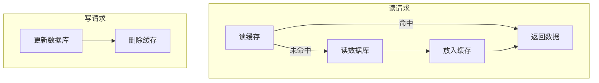
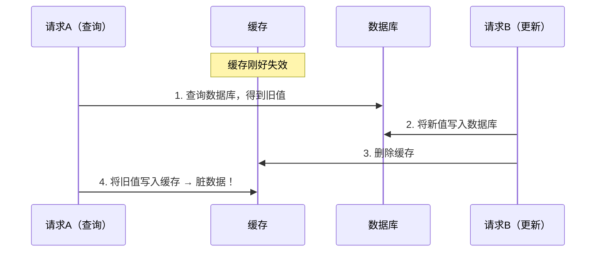
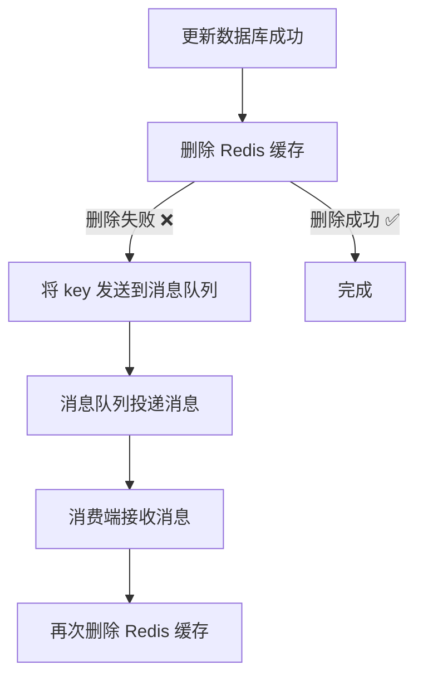
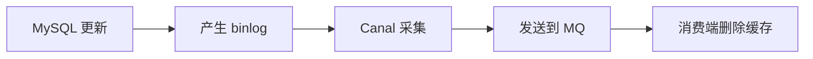

大部分面向公众的互联网系统，其并发请求数量与在线用户数量都是正相关的，而 MySQL 能够承担的并发读写量是有一定上限的，当系统的访问量超过一定程度的时候，纯 MySQL 就很难应付了。

绝大多数互联网系统都是采用 MySQL + Redis 这对经典组合来解决高并发问题的。Redis 作为 MySQL 的前置缓存，可以应对绝大部分查询请求，从而在很大程度上缓解 MySQL 并发请求的压力，但是不能一说到缓存脑海中就只有 Redis，这无论在工作还是面试中都不合适，所以我们先全面了解缓存。

> 了解了缓存的全局视图之后，本文的核心将聚焦在 **MySQL + Redis 场景下，如何保证缓存与数据库的数据一致性**——这是高并发系统设计中最经典也最容易踩坑的问题。

---

## 缓存不仅仅是 Redis

### 缓存的意义

从浏览器到网络，再到应用服务器，甚至到数据库，通过在各个层面应用缓存技术，整个系统的性能将大幅提高。

例如，缓存离客户端更近（缓存一定是离用户越近越好），从缓存请求内容比从源服务器所用时间更少，呈现速度更快，系统就显得更灵敏。缓存数据的重复使用，大大降低了用户的带宽使用，其实也是一种变相的省钱，同时保证了带宽请求在一个低水平上，更容易维护。

所以，使用缓存技术，可以降低系统的响应时间，减少网络传输时间和应用延迟时间，进而提高了系统的吞吐量，增加了系统的并发用户数。利用缓存还可以最小化系统的工作量，使用了缓存就可以不必反复从数据源中查找，缓存所创建或提供的同一条数据更好地利用了系统的资源，并且能够更好的保护后端的系统和服务。

因此，**缓存是系统调优时常用且行之有效的手段**，无论是操作系统还是应用系统，缓存策略无处不在。

### 缓存的分类

缓存分布在系统的各个层面，从客户端到服务端，越靠近用户效果越好。整体可归类如下：

| 层级 | 类型 | 核心说明 |
|------|------|----------|
| **客户端缓存** | 页面缓存 | 将渲染后的页面保存为文件 / HTML5 localstorage 离线缓存，避免重复网络连接 |
| | 浏览器缓存 | 通过 HTTP 缓存头（Expires / Cache-Control / E-tag）控制资源副本的存储与复用 |
| | APP 缓存 | 内存、文件或本地数据库（SQLite），对业务组件透明 |
| **网络缓存** | Web 代理缓存 | 正向代理（客户端设置）、反向代理（Nginx 等，对客户端透明）、透明代理 |
| | 边缘缓存（CDN） | 部署大量边缘节点，用户就近访问，大幅降低延迟 |
| **服务端缓存** | 数据库缓存 | MySQL Buffer Pool、Query Cache 等数据库自带缓存 |
| | 应用级缓存 | Redis / Memcached 等，作为数据库的前置缓存层 |
| | 平台级缓存 | 统一缓存平台中间件，在应用层之上提供缓存能力 |

下面逐层简要说明，重点关注与后端一致性相关的缓存类型。

#### 客户端缓存

- **页面缓存**：将渲染后的页面保存为文件或利用 HTML5 localstorage 离线缓存，避免重复网络请求。
- **浏览器缓存**：通过 HTTP 缓存头（Expires / Cache-Control / E-tag）控制资源副本存储，命中时几乎即时呈现。
- **APP 缓存**：将内容缓存在内存、文件或本地数据库（SQLite）中，对业务组件透明的缓存设计是关键。

#### 网络缓存

- **Web 代理缓存**：正向代理（客户端设置）、反向代理（如 Nginx，对客户端透明）、透明代理三种形态。
- **边缘缓存（CDN）**：部署大量边缘节点，用户就近访问，大幅降低延迟。

#### 服务端缓存

- **数据库缓存**：MySQL Buffer Pool、Query Cache 等数据库自带缓存。
- **应用级缓存**：Redis / Memcached 等，作为数据库的前置缓存层——这就是本文要讨论的核心场景。
- **平台级缓存**：统一缓存平台中间件，在应用层之上提供缓存能力。

---

## 如何保证缓存的数据一致性

### 工程实践

保证缓存和数据库双写一致性，主要有以下四类方案：

#### 更新缓存类

##### 1. 先更新缓存，再更新 DB



- ❌ **不推荐**。并发场景下，可能会出现缓存和数据库数据不一致的情况。

##### 2. 先更新 DB，再更新缓存



- ❌ **不推荐**。如果两个并发写操作，后写数据库的先写缓存，就会导致数据覆盖问题，出现脏数据。

#### 删除缓存类（推荐）

##### 3. 先删除缓存，后更新 DB



**并发问题分析：**

假设有两个并发请求 —— 请求 A（更新）和 请求 B（查询）：



此时缓存中是旧值，数据库是新值，**数据不一致**。

**改进方案：延迟双删**



在更新数据库后，休眠一段时间，再删除一次缓存，以清除查询回填的脏数据。

**延迟双删的不足：**

1. sleep 时间不好估算，需要对业务读取数据库和写缓存的时间有清晰认知
2. 吞吐量会降低，因为写请求需要等待一段时间再返回

**优化：异步延迟双删** —— 将第二次删除操作交给异步线程执行，避免阻塞主流程，提升吞吐量。

```java
// 延迟双删 —— 异步优化版
public void updateWithDelayDoubleDelete(String key, Object value) {
    redis.delete(key);                           // 1. 先删缓存
    db.update(value);                            // 2. 更新数据库
    asyncPool.execute(() -> {                     // 3. 异步延迟再删
        Thread.sleep(500);                       // sleep 时间 ≈ 读DB+写缓存耗时
        redis.delete(key);
    });
}
```

##### 4. 先更新 DB，后删除缓存（Cache Aside）✅



**并发问题分析：**

假设有两个并发请求 —— 请求 A（查询）和 请求 B（更新）：



**为什么这个方案仍然推荐？**

以上情况需要满足一个先天性条件：步骤 3（写数据库）比步骤 2（读数据库）耗时更短。但在实际场景中，数据库的读操作速度远快于写操作——以 MySQL InnoDB 为例，读操作通常只需微秒级（内存命中），而写操作涉及 redo log、binlog、索引更新等，通常比读慢 **几倍到几十倍**（这也是读写分离的核心意义所在），所以这一情形**极难出现**。

**Cache Aside 伪代码实现：**

```java
// 读 —— 先查缓存，未命中则查 DB 并回填
public Object read(String key) {
    Object value = redis.get(key);
    if (value != null) return value;            // 缓存命中，直接返回

    value = db.query(key);                      // 缓存未命中，查数据库
    if (value != null) {
        redis.set(key, value, EXPIRE_TIME);     // 回填缓存 + 过期时间兜底
    }
    return value;
}

// 写 —— 先更新 DB，再删除缓存
public void write(String key, Object value) {
    db.update(key, value);                      // 1. 先更新数据库
    redis.delete(key);                          // 2. 再删除缓存
}
```

**防御措施：**

1. **给缓存设置过期时间**：即使出现脏数据，也会在过期后自动清除
2. **异步延时删除策略**：更新 DB 并删除缓存后，异步延迟一段时间再删一次

**删除缓存失败怎么办？**

更新数据库成功了，但删除缓存出错，此时读缓存会一直读到错误数据。解决方案：

**方案一：消息队列补偿**



缺点：对业务代码侵入大，耦合严重。

**方案二：订阅 MySQL binlog（推荐）**



通过订阅 MySQL 数据库的 binlog 日志，借助 Canal 等工具将变更事件发送到消息队列，再异步删除缓存。这种方案与业务代码完全解耦，是业界推荐的工程实践。

**Canal 接入要点：**

| 步骤 | 说明 |
|------|------|
| MySQL 开启 binlog | `binlog_format=ROW`（必须），`binlog_row_image=FULL` |
| Canal 订阅 | 伪装成 MySQL slave，解析 binlog 事件 |
| 事件过滤 | 只关注目标库/表，过滤无关事件 |
| 发送 MQ | 将变更事件投递到 Kafka / RocketMQ |
| 消费端处理 | 从 MQ 消费事件，解析 key 后删除对应缓存 |

---

## 缓存更新的设计模式

前面讨论的四种方案，本质上对应了不同的缓存更新设计模式。理解这些模式有助于从更高层次把握选型逻辑：

| 前面的方案 | 对应的设计模式 | 说明 |
|------------|---------------|------|
| 方案 1、2（更新缓存） | — | 属于反模式，无标准模式对应 |
| 方案 3（先删缓存，后更新 DB） | 变体 | 可视为 Cache Aside 的变体，但并发安全性更差 |
| 方案 4（先更新 DB，后删缓存） | **Cache Aside** | 标准实现，业界最广泛使用 |

### Cache Aside

前面方案 4 正是 Cache Aside 模式的具体落地。应用代码同时维护缓存和数据库：

- **读**：先读缓存，未命中则读数据库并回填缓存
- **写**：先更新数据库，再删除缓存

Facebook 的论文《Scaling Memcache at Facebook》也使用了这个策略。

> 缓存一致性如果追求强一致，要么串行化，要么使用分布式读写锁，要么通过 2PC 或 Paxos 协议保证一致性，要么就是拼命降低并发时脏数据的概率。一般大厂包括 Facebook 都选择了降低概率的做法，因为强一致的实现性能往往比较差，而且比较复杂，还要考虑各种容错问题。

### Read/Write Through

Cache Aside 中应用代码需要维护两个数据存储（缓存 + 数据库），较为繁琐。而 **Read/Write Through** 将更新数据库的操作由缓存自己代理，对应用层来说简单很多 —— 应用认为后端就是一个单一的存储，而存储自己维护自己的 Cache。

#### Read Through

当缓存失效时（过期或 LRU 换出），Cache Aside 是由调用方负责把数据加载入缓存，而 Read Through 则由缓存服务自己来加载，对应用方透明。

#### Write Through

与 Read Through 相仿，当有数据更新时：

- 未命中缓存 → 直接更新数据库，返回
- 命中缓存 → 更新缓存，再由 Cache 自己更新数据库（同步）

### Write Behind Caching

Write Behind 又叫 Write Back，Linux 文件系统的 Page Cache 也是同样算法。

核心思路：**更新数据时只更新缓存，不更新数据库**，由缓存异步批量更新数据库。

**优点：**

- I/O 操作飞快（因为异步，write back 还能合并对同一数据的多次操作）
- 性能提升相当可观

**缺点：**

- 数据不是强一致性的
- 可能丢数据（Unix/Linux 非正常关机会导致数据丢失）
- 实现逻辑复杂，需要追踪哪些数据被更新、需要刷到持久层

---

## 总结

| 方案 | 描述 | 推荐度 |
|------|------|--------|
| 先更新缓存，再更新 DB | 并发写容易出错 | ❌ 不推荐 |
| 先更新 DB，再更新缓存 | 并发写可能数据覆盖 | ❌ 不推荐 |
| 先删除缓存，后更新 DB + 延迟双删 | sleep 时间难掌控 | ⚠️ 可用但不完美 |
| 先更新 DB，后删除缓存（Cache Aside） | 标准方案 + 过期时间兜底 | ✅ 推荐 |
| Read/Write Through | 缓存代理 DB 操作 | ✅ 简化应用层 |
| Write Behind Caching | 异步批量写 DB | ⚠️ 高性能但可能丢数据 |

**最佳工程实践：Cache Aside + 缓存过期时间 + binlog 异步补偿（Canal → MQ），在一致性、性能和复杂度之间取得最佳平衡。**

### 选型决策指南

根据业务场景快速决策：

| 场景 | 推荐方案 | 关键配置 |
|------|---------|---------|
| 中小项目 / 快速上线 | Cache Aside + 缓存过期时间 | 过期时间兜底即可，无需 binlog |
| 高并发读写 / 核心业务 | Cache Aside + binlog 异步补偿 | Canal → MQ，确保最终一致性 |
| 对一致性要求极高 | 串行化 / 分布式锁 / 2PC | 牺牲性能换强一致，谨慎使用 |
| 写多读少 / 准实时场景 | Write Behind Caching | 异步批量刷盘，可接受短暂延迟 |
| 希望简化应用层代码 | Read/Write Through | 缓存框架封装一致性逻辑 |

---
